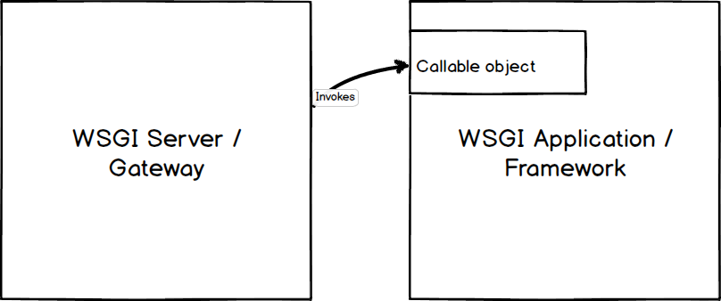

# WSGI 是什么

在构建 Web 应用时，通常会有 Web Server 和 Application Server 两种角色。其中 Web Server 主要负责接受来自用户的请求，解析 HTTP 协议，并将请求转发给 Application Server，Application Server 主要负责处理用户的请求，并将处理的结果返回给 Web Server，最终 Web Server 将结果返回给用户。

由于有很多动态语言和很多种 Web Server，他们彼此之间互不兼容，给程序员造成了很大的麻烦。因此就有了 CGI/FastCGI 协议，定义了 Web Server 如何通过输入输出与 Application Server 进行交互，将 Web 应用程序的接口统一了起来。

那么 WSGI 又是什么呢？WSGI（Web Server Gateway Interface） 是 [Python PEP333](https://www.python.org/dev/peps/pep-0333/)中提出的一个 Web 开发统一规范（后更新为 [PEP3333](https://www.python.org/dev/peps/pep-3333/)）。虽然前面说过，有了 CGI/FastCGI 协议，不同的 Application Server 和 Web Server 之前能够以相同的规范进行交互。但是，Web 应用的开发通常都会涉及到 Web 框架的使用，各个 Web 框架内部由于实现不同相互不兼容，给用户的学习，使用和部署造成了很多麻烦。WSGI 就是一个用于统一 Application Server 和 Web 框架之间交互和调用的规范。WSGI 约定了怎么调用 web 应用程序的代码，web 应用程序需要符合什么样的规范，只要 web 应用程序和 Application Server 都遵守 WSGI 协议，那么，web 应用程序和  Application Server 就可以随意的组合，开发者也可以编写具有通用功能的 WSGI middleware，可以被加载到任务 WSGI Server 中。


# WSGI 标准简介

WSGI 标准中主要定义了两种角色：

- "server" 或 "gateway" 端
- "application" 或 "framework" 端

这两种角色的调用关系如下图：



这里可以看到，WSGI 服务器需要调用应用程序的一个可调用对象，这个可调用对象（callable object）可以是一个函数，方法，类或者可调用的实例，总之是可调用的。

下面是一个 callable object 的示例，这里的可调用对象是一个函数：

```python
def simple_app(environ, start_response):
    """Simplest possible application object"""
    status = '200 OK'
    response_headers = [('Content-type', 'text/plain')]
    start_response(status, response_headers)
    return ['Hello World']
```

这里，我们首先要注意，这个对象接收两个参数：

- `environ`：请求的环境变量，它是一个字典，包含了 HTTP 请求的首部，方法等信息
- `start_response`：一个回调函数，在返回内容之前必须先调用这个回掉函数

上面的 `start_response` 这个回调函数的作用是用于让 WSGI Server 返回响应的 HTTP 首部和 HTTP 状态码。这个函数有两个必须的参数，返回的状态码和返回的响应首部组成的元祖列表。返回状态码和首部的这个操作始终都应该在响应 HTTP body 之前执行。

还需要注意的是，最后的返回结果，应该是一个可迭代对象，这里是将返回的字符串放到列表里。如果直接返回字符串可能导致 WSGI 服务器对字符串进行迭代而影响响应速度。

当然，这个函数是一个最简单的可调用对象，它也可以是一个类或者可调用的类实例。

## WSGI Server & Web 框架

首先 Web 框架是什么？

基于之前对 WSGI 的简单介绍，一个 Web 框架至少要能够 WSGI Server 提供一个 callable object，每一次请求 WSGI Server 都会调用这个 callable object 来完成。一般来说，一个 Web 框架还需要对开发者提供如下功能：

- URL 的匹配和路由转发
- Request/Response 的封装
- 错误、异常的处理
- session 的支持
- 模板的支持
- 数据库 ORM 的支持
- 一些高级功能如 Form 表单对象，admin 后台管理的支持等

以上功能都是 Web 框架对开发者提供的接口，而 WSGI 服务器只关心需要调用的 callable object. Python 的 wsgiref 库就实现了一个简单的 WSGI 服务器，我们可以借助这个 WSGI 服务器来测试我们的 application.

## Werkzeug

Werkzeug 是一个 WSGI 工具包，它可以作为 web 框架的底层库，当 web 框架的开发者更轻松的开发 WSGI Web 框架。在之前，我们使用这样的方式构造我们的 WSGI 应用：

```python
def application(environ, start_response):
    start_response('200 OK', [('Content-Type', 'text/plain')])
    return ['Hello World!']
```

Werkzeug允许我们以一个轻松的方式访问数据，提供了更好的方法来创建响应。如下所示：

```python
from werkzeug.wrappers import Response

 def application(environ, start_response):
    response = Response('Hello World!', mimetype='text/plain')
    return response(environ, start_response)
```

## wsgiref

我们可以借助 python 的 `wsgiref` 库运行一个 WSGI 服务器（当然这个 WSGI 服务器同时也是 Web 服务器），用它来运行我们的 application.

```python
#! /usr/bin/env python

from wsgiref.simple_server import make_server

def application (environ, start_response):

    # 这里从 environ 字典中获取所有的变量值
    response_body = [
        '%s: %s' % (key, value) for key, value in sorted(environ.items())
    ]
    response_body = '\n'.join(response_body)

    status = '200 OK'
    response_headers = [
        ('Content-Type', 'text/plain'),
        ('Content-Length', str(len(response_body)))
    ]
    start_response(status, response_headers)

    return [response_body]

# 启动 WSGI  服务器
httpd = make_server (
    'localhost',
    8051,
    application # 这里指定我们的 application object)

# 开始处理请求
httpd.handle_request()
```

运行上面的程序，并访问 http://localhost:8051，将返回此次请求所有的首部信息。

这里，我们利用 environ 字典，获取了请求中所有的变量信息，构造成相应的内容返回给客户端。

environ 这个参数中包含了请求的首部，URL，请求的地址，请求的方法等信息。可以参考 [PEP3333](https://www.python.org/dev/peps/pep-3333/#environ-variables) 来查看 environ 字典中必须包含哪些 CGI 变量。

## WSGI Server

上面我们使用 `wsgiref` 库中的 WSGI 服务器来运行我们的程序，其实，知道了 WSGI 标准，我们可以自己实现一个 WSGI 服务器，它需要实现如下基本功能：

- 监听端口，接收请求
- 解析 HTTP 协议
- 调用 application，构造响应首部
- 将响应返回给客户端

这里是一个 WSGI Server 的范例：

```python
import socket
import StringIO
import sys


class WSGIServer(object):

    address_family = socket.AF_INET
    socket_type = socket.SOCK_STREAM
    request_queue_size = 1

    def __init__(self, server_address):
        # 创建监听端口
        self.listen_socket = listen_socket = socket.socket(
            self.address_family,
            self.socket_type
        )
        listen_socket.setsockopt(socket.SOL_SOCKET, socket.SO_REUSEADDR, 1)
        listen_socket.bind(server_address)
        listen_socket.listen(self.request_queue_size)
        # 获取主机名和端口信息
        host, port = self.listen_socket.getsockname()[:2]
        self.server_name = socket.getfqdn(host)
        self.server_port = port
        self.headers_set = []

    def set_app(self, application):
        self.application = application

    def serve_forever(self):
        listen_socket = self.listen_socket
        while True:
            # 处理客户端连接
            self.client_connection, client_address = listen_socket.accept()
            self.handle_one_request()

    def handle_one_request(self):
        self.request_data = request_data = self.client_connection.recv(1024)
        # 打印接收的数据
        print(''.join(
            '< {line}\n'.format(line=line)
            for line in request_data.splitlines()
        ))

        self.parse_request(request_data)

        # 使用请求的信息构造 CGI 环境变量
        env = self.get_environ()

        # 调用 WSGI callable object
        result = self.application(env, self.start_response)

        # 将结果响应给客户端
        self.finish_response(result)

    def parse_request(self, text):
        request_line = text.splitlines()[0]
        request_line = request_line.rstrip('\r\n')
        # 解析 HTTP request line
        (self.request_method,  # GET
         self.path,            # /hello
         self.request_version  # HTTP/1.1
         ) = request_line.split()

    def get_environ(self):
        # 构造响应的 WSGI 环境变量
        env = {
        		'wsgi.version': (1, 0),
        		'wsgi.url_scheme: 'http',
        		'wsgi.input': StringIO.StringIO(self.request_data),
        		'wsgi.errors': sys.stderr,
        		'wsgi.multithread': False,
        		'wsgi.run_once': False,
        		'REQUEST_METHOD': self.request_method,
        		'PATH_INFO': self.path,
        		'SERVER_NAME': self.server_name,
        		'SERVER_PORT': str(self.server_port),
        	}
        return env

    def start_response(self, status, response_headers, exc_info=None):
        # 构造响应的首部和状态码
        server_headers = [
            ('Date', 'Tue, 31 Mar 2015 12:54:48 GMT'),
            ('Server', 'WSGIServer 0.2'),
        ]
        self.headers_set = [status, response_headers + server_headers]

    def finish_response(self, result):
        try:
            status, response_headers = self.headers_set
            response = 'HTTP/1.1 {status}\n'.format(status=status)
            for header in response_headers:
                response += '{0}: {1}\n'.format(*header)
            response += '\n'
            for data in result:
                response += data
            # Print formatted response data a la 'curl -v'
            print(''.join(
                '> {line}\n'.format(line=line)
                for line in response.splitlines()
            ))
            self.client_connection.sendall(response)
        finally:
            self.client_connection.close()


SERVER_ADDRESS = (HOST, PORT) = '', 8888


def make_server(server_address, application):
    server = WSGIServer(server_address)
    server.set_app(application)
    return server


if __name__ == '__main__':
    if len(sys.argv) < 2:
        sys.exit('请提供可用的wsgi应用程序, 格式为: module:callable')
    app_path = sys.argv[1]
    module, application = app_path.split(':')
    module = __import__(module)
    application = getattr(module, application)
    httpd = make_server(SERVER_ADDRESS, application)
    print('WSGIServer: Serving HTTP on port {port} ...\n'.format(port=PORT))
    httpd.serve_forever()
```

上面的 WSGI 服务器运行过程为：

1. 初始化，创建套接字，绑定端口
2. 接收客户端请求
3. 解析 HTTP 协议
4. 构造 WSGI 环境变量（`environ`）
5. 调用 application
6. 回调函数 `start_response` 设置好响应的状态码和首部
7. 返回信息

本文对 WSGI 进行了简单的介绍，关于更多 WSGI 的细节，可以阅读 [PEP3333](https://www.python.org/dev/peps/pep-3333)。

参考：

- [WSGI Tutorial](http://wsgi.tutorial.codepoint.net/intro)
- [Let’s Build A Web Server](https://ruslanspivak.com/lsbaws-part1/)
- [PEP3333](http://wsgi.tutorial.codepoint.net/intro)


