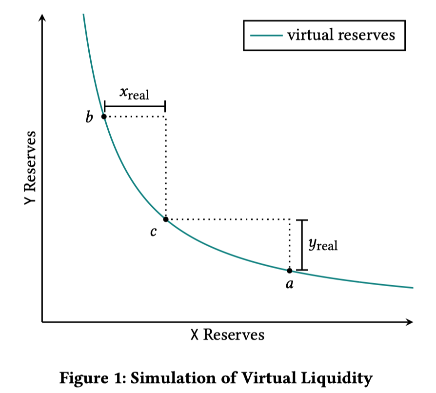
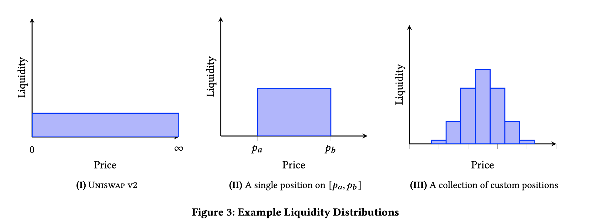

刚看完 Uniswap v2 的代码，本来打算写一个 Uniswap v2 设计与实现，结果 Uniswap v3 就发布了。趁着这个机会就先写一个 Uniswap v3 设计与实现吧。

因为 v3 版本的实现复杂度和 v2 已经不在一个量级了，难免会有理解上的偏差，本文权当是抛砖引玉，也希望有更多的人参与讨论。因为实现比较复杂，本系列会拆分成多篇文章，持续更新。

本文假定读者都能理解 AMM 的基本概念，并且阅读过 v3 的实现细节（最好读过白皮书）来撰写的，因此不会具体的解释每一个概念的实现逻辑。

前置阅读资料：

- [官方博客](https://uniswap.org/blog/uniswap-v3/)
- [v3 白皮书](https://uniswap.org/whitepaper-v3.pdf)

## 设计原理

官方的白皮书已经比较详尽的描述了 v3 的设计原理，这里仅对白皮书中的内容做一些补充，包含本人对其中一些机制的理解和思考。

Uniswap v2 版本使用 $x \cdot y = k$ 这样一个简洁的公式实现了 AMM Dex，正是由于其简洁易用性，使其在短短的一年的时间内迅速成长为 DeFi 领域的龙头项目。但是随着 DeFi 生态走过了「从无到有」的阶段，因为 v2 无法满足某些特定需求，从而诞生了 Curve, Balancer 这些针对某些功能进行改进的 AMM。

简单来说，官方认为 v2 版本最大的痛点是资金利用率（Capital Efficiency）太低，v3 版本在解决这个问题的同时，还带了了新的改进，总体总结如下：

- 可灵活选择价格区间提供流动性
- 更好用的预言机
- order book 功能
- 灵活的费率

### 提升资金利用率

解决资金利用问题之前，我们可以观察到大部分的交易对的价格，在大部分时间内都只是在一个固定范围内波动。例如 ETH/DAI 交易对，在近一个月时间内都是在 1300 ~ 2200 DAI/ETH 这个范围内波动。更极端的例子是 DAI/USDC 这样的稳定币交易对，在大部分时间内都只是在 1.001 ~ 1.002 DAI/USDC 范围内波动。

### v2 的问题

我们先来看一看 v2 版本的资金利用率是怎样的，假设 ETH/DAI 交易对的实时价格为 1500 DAI/ETH，交易对的流动性池中共有资金：4500 DAI 和 3 ETH，根据 $x \cdot y = k$，可以算出池内的 k 值：

$$k = 4500 \times 3 = 13500$$

假设 $x$ 表示 DAI，$y$ 表示 ETH，即初始阶段 $x_1 = 4500, y_1 = 3$，当价格下降到 1300 DAI/ETH 时：

$$
\begin{cases}
x_2 \cdot y_2 = 13500 \\
\displaystyle \frac {x_2}{y_2} = 1300
\end{cases}
$$

得出 $x_2 = 4192.54, y_2 = 3.22$，资金利用率为：$\frac {\Delta x}{x_1} = 6.84\%$。同样的计算方式，当价格变为 2200 DAI/ETH 时，资金利用率约为 21.45%.

也就是说，在大部分的时间内池子中的资金利用与低于 25%. 这个问题对于稳定币池来说更加严重。

### 解决方案

v3 版本的解决方案是允许用户只在一段价格区间内提供流动性。如下图：

此图展示了一个 $x \cdot y = k$ 的函数曲线图。为了满足让用户可以选择只在 $[a, b]$ 价格区间内提供流动性。对于图中 $[a, b]$ 区间的任意点，都有：

$$
x = x_{virtual} + x_{real} \\
y = y_{virtual} + y_{real}
$$

其中 $x_{real}, y_{real}$ 分别表示用户提供的 x token, y token 数量，$x_{virtual}, y_{virtual}$ 分别表示流动池虚拟出的 x token y token 数量。当流动池的价格来到用户设置的零界点时（例如图中的 a 点或者 b 点），用户实际提供的 x token 或者 y token 将为 0，x 或 y 将完全由虚拟 token 组成。当价格进一步变动，移动到用户设定的价格区间之外时，流动池将移除这部分流动性，以保证虚拟的 x token 或 y token 数量不会减少，因此这部分虚拟的 token 只会在价格处于设定的区间内时参与价格的计算，而不会真的参与流动性提供。

例如，当价格到达 a 点时，用户的所有资金转换为 x，此时 $y_{real} = 0, y = y_{virtual}$，当价格继续降低时，流动池将移除这部分流动性。用户的资金状态将停留在 a 点，直至价格再次回到 a 点并进入 $[a, b]$ 价格区间。

通过这样的设计，用户的资金只会在 $[a, b]$价格区间内提供流动性，并且因为虚拟 token $x_{virtual}, y_{virtual}$ 的参与，这部分流动性也满足 $x \cdot y = k$ 公式，计算价格的方式并没有产生变化。

上图展示了用户选择在价格 $[a, b]$ 之间提供流动性时，通过虚拟 token 的参与，将曲线 $f(real)$ (橘红色)向右上方移动至 $f(virtual)$（绿色），实现了价格计算的一致性（即满足$x \cdot y = k$）。

### 交易过程

#### v2 版本

在 v2 版本中，用户与一个交易对发生交易时，假设用户提供 x token，资金量为 $\Delta x$，AMM 需要计算出用户可以得到的 y token，即 $\Delta y$. 如下图所示，池中资金从 a 点随着曲线移动到 b 点：

可以用过下面步骤计算 $\Delta y$：

$$
x \cdot y = (x + \Delta x)(y - \Delta y) = k
$$

计算出：

$$
\Delta y = y - \frac {x \cdot y}{x+\Delta x} = \frac {\Delta x y}{x + \Delta x}
$$

具体的实现，可以参考 [v2 代码实现](https://github.com/Uniswap/uniswap-v2-periphery/blob/dda62473e2da448bc9cb8f4514dadda4aeede5f4/contracts/libraries/UniswapV2Library.sol#L42-L50)。

#### v3 版本

在 v3 版本中，因为一个交易池中会有多个不同深度的流动池（每一个可以单独设置交易价格区间），因此一次交易的过程可能跨越多个不同的深度：

如上图最右边所示，当价格变化时，流动池中的总流动性也会随之变化。因此 v3 版本流动池中资金的关系不能像 v2 版本一样用一个平滑的 bonding curve 曲线来表示。那么如何计算交易结果呢？

因为 v3 版本交易可能并不在一个平滑的曲线中进行，需要根据池中资金的价格，选用不用的流动性来进行计算。流动性可以用 $k$ 表示，即 $k = x \cdot y$，用 $P$ 表示 $x$ 的价格，即 $P = \frac yx$

因为每一次的价格变动都可能会引起流动性的变化，v3 需要围绕价格来进行交易相关的计算，例如当使用 x token 交换 y token 时：

- 交易至指定价格（通常是某一个流动性的价格边界）$P$，需要的 x token 数 $\Delta x$，可以获得的 y token 数 $\Delta y$
- 给定 x token 数 $\Delta x$（假设此交易不会引起流动性发生变化），可以获得的 y token 数 $\Delta y$，以及最终的价格 $P$

当 k 值不变时，根据定义：

$$
\begin{cases}
x \cdot y = k \\
P = \displaystyle \frac {y}{x}
\end{cases}
$$

可以推导出：

$$
\begin{cases}
x = \sqrt {\displaystyle \frac {k}{P}} \\
y = \sqrt {kP}
\end{cases}

\Rightarrow

\begin{cases}
\Delta x  = \Delta \displaystyle \frac 1{\sqrt P} \cdot \sqrt k \\
\Delta y  = \Delta \sqrt P \cdot \sqrt k
\end{cases}
$$

这样一来计算过程并不需要关注池中的 x token 和 y token 余额，通过 $k$ 值和价格 $P$ 就可以完成交易过程的计算。

为了减少计算过程中的开根号运算，v3 合约直接存储 $\sqrt P$ 的值，同时合约中没有存储 $k$ 的值而是存储 $L = \sqrt k$，通过 $L$ 来表示池中当前的流动性大小（存储 $L$ 还有一个好处是减少溢出的可能性）。

在实际交易过程中，一个交易可能跨越不同的流动性阶段，因此合约需要维护每个用户提供流动性的价格边界，当价格到达边界时，需要增加或移除对应流动性。通过分段计算的方式完成交易结果的计算，具体的实现过程会在后面的代码分析中讲解。

### 价格精度问题

因为用户可以在任意 $[P_0, P_1]$ 价格区间内提供流动性，Uniswap v3 需要保存每一个用户提供流动性的边界价格，即 $P_0$ 和 $P_1$。这样就引入了一个新的问题，假设两个用户提供的流动性价格下限分别是 5.00000001 和 5.00000002，那么 Uniswap 需要标记价格为 5.00000001 和 5.00000002 的对应的流动性大小。同时当交易发生时，需要将 $[5.00000001, 5.00000002]$ 作为一个单独的价格区间进行计算。这样会导致：

- 几乎很难有两个流动性设置相同的价格边界，这样会导致消耗大量合约存储空间保存这些状态
- 当进行交易计算时，价格变化被切分成很多个小的范围区间，需要逐一分段进行计算，这会消耗大量的 gas，并且如果范围的价差太小，可能会引发计算精度的问题

Uniswap v3 解决这个问题的方式是，将 $[P_{min}, P_{max}]$ 这一段连续的价格范围为，分割成有限个离散的价格点。每两个相邻的价格区间称为一个 tick，用户在设置流动性的价格区间时，只能选择这些离散的价格点中的某一个作为流动性的边界价格。

Uniswap v3 采用了等比数列的形式确定价格数列，公比为 1.0001。即下一个价格点为当前价格点的 100.01%，前面我们说过 Uniswap v3 实际存储的是 $\sqrt P$，那么下一个价格与当前价格的关系为

$$
\sqrt {P_{next}} = \sqrt {1.0001} \cdot \sqrt {P_{current}}
$$

如此一来 Uniswap v3 可以提供比较细粒度的价格选择范围（每个可选价格之间的差值为 0.01%），同时又可以将计算的复杂度控制在一定范围内。

### tick 管理

简单说，一个 tick 就代表 Uniswap 价格的等比数列中的某一个价格，因此每一个用户提供的流动性的价格边界可以用 $tick_{lower}$ 和 $tick_{upper}$ 来表示。为了计算的方便，对于每一个交易对，uni 都定义有一个价格为 1 的 tick。将所有 tick 通过索引来表示，定义整数 $i$ 表示 tick 的索引：

$$
i = \log_{\sqrt {1.0001}}{\sqrt p}
$$

这样一来，只需要通过整数索引 $i$ 就能找到对应的 tick，并且 $i$ 为 0 时价格为 1.

Uniswap 不需要记录每个 tick 所有的信息，只需要记录所有作为 upper/lower tick 所包含的流动性元数据即可。看下面这个例子：

两个用户分别在 $[a, c]$ 和 $[b, d]$ 两个区间提供了流动性 $L_1$ 和 $L_2$，对于 Uniswap 来说它会在 a, b, c, d 四个 tick 上记录对应的流动性增减情况。例如当价格从图中从左向右移动时，代币池的流动性需要做对应的增减（即从左侧 tick 进入一个流动性时增加流动性，移出流动性的右侧 tick 时减去相应的流动性）。

### 灵活的手续费选择

v3 版本内置了三种梯度的手续费率（0.05%, 0.30%, and 1.00%），同时可以在未来增加更多的费率值。关于手续费的计算过程，这部分放在后文来详解（链接：[交易手续费](/uniswap-v3-4/)）。需要注意的是，由于需要支持多种费率，同一个代币对 v3 版本会有多个不同的流动池。例如 ETH/DAI 代币对，会分成三个池，分别对应 0.05%, 0.30%, 1.00% 的手续费。

更多的费率选择性，这样做会更加灵活，但是同时也会带来一定的流动性分裂，uni 官方表示后续可以通过治理添加更多的费率可选值，这也势必会让流动性更加分裂。那么可能会出现一种情况是，即使是只使用 uniswap v3 这单个 AMM 来完成一笔交易，但是因为代币对的流通性分散在多个池子中。那么最优的交易策略是使用交易聚合器（例如 1inch）来进行交易，即将单笔交易拆散，同时使用多个流动性池来完成交易。就目前 uniswap v3 前端代码情况来看，官方的界面是不支持这种聚合交易的，其 sdk 代码中的注释也说明了这个问题：[SDK 代码](https://github.com/Uniswap/uniswap-v3-sdk/blob/cc0c54448ce8702e44e529f03e59b2ea7f5c7fe7/src/entities/trade.ts#L263-L264)。

#### 手续费与 tick 的关系

前文说过，为了减少开根号的计算，Uniswap 记录的是 $\sqrt P$，v3 使用 `Q64.96` 精度的定点数来存储 $\sqrt P$ 的内容，那么可以支持的 $\sqrt {P_{max}} \approx 2^{64}$，为了对应，让 $\sqrt {P_{min}} = 2^{-64}$

那么可以计算出对于 tick 来说， $i_{min} = -887272, i_{max} = 887272$

我们知道 tick 越多，价格可选的值越精细，但是合约在计算时候的价格区间就可能越多，那么 gas 消耗也会更加的多，因此我们需要让 tick 的数量保持在一个合理的范围内。Uniswap 针对不同类型的代币对推荐使用不同类型的费率。

例如稳定币交易对 USDC/USDT，它的范围波动比较小，我们需要给它更精细的价格可选值，并且设置一个比较低的手续费（0.05%）。Uniswap 引入了 `tickSpacing` 的概念，即每个 tick 之间跳过 N 个 tick，这样让合约在计算的时候，gas 更可控。

对于价格波动较小的交易池，我们希望 tickSpacing 更小，这样价格可选值更多，同时也希望费率更低。反之波动大的交易对，可以让 tickSpacing 更大，这样更节约 gas，但是我们希望它的费率更高。

Uniswap 默认设置了费率和 tickSpacing 的关系：

|  费率   | tickSpacing  |
|  ----  | ----  |
| 0.05%  | 10 |
| 0.30%  | 60 |
| 1.00%  | 200 |

## 代码架构

Uniswap v3 在代码层面的架构和 v2 基本保持一致，将合约分成了两个仓库：

- [uniswap-v3-core](https://github.com/Uniswap/uniswap-v3-core)
- [uniswap-v3-periphery](https://github.com/Uniswap/uniswap-v3-periphery)

core 仓库的功能主要包含在以下 2 个合约中：

- **UniswapV3Factory**: 提供创建 pool 的接口，并且追踪所有的 pool
- **UniswapV3Pool**: 实现代币交易，流动性管理，交易手续费的收取，oracle 数据管理。接口的实现粒度比较低，不适合普通用户使用，错误的调用其中的接口可能会造成经济上的损失。

peirphery 仓库的功能主要包含在以下 2 个合约：

- **SwapRouter**: 提供代币交易的接口，它是对 UniswapV3Pool 合约中交易相关接口的进一步封装，前端界面主要与这个合约来进行对接。
- **NonfungiblePositionManager**: 用来增加/移除/修改 Pool 的流动性，并且通过 NFT token 将流动性代币化。使用 ERC721 token（v2 使用的是 ERC20）的原因是同一个池的多个流动性并不能等价替换（v3 的集中流性动功能）。

这些合约间的关系大致如下图：

本系列后续会从常用的 Uniswap v3 操作入手，讲解代码调用流程。一般来说，用户的操作都是与 [uniswap-v3-periphery](https://github.com/Uniswap/uniswap-v3-periphery) 开始。

### Update 05-23

本系列文章主要参考的是 Uniswap v3 3月底的代码，已经和其最新代码又一定差异，但是这部分差异不大，并不会影响主体业务逻辑的理解。

## Uniswap v3 详解系列
本系列所有文章：

- [Uniswap v3 详解（一）：设计原理](/uniswap-v3-1)
- [Uniswap v3 详解（二）：创建交易对/提供流动性](/uniswap-v3-2)
- [Uniswap v3 详解（三）：交易过程](/uniswap-v3-3)
- [Uniswap v3 详解（四）：交易手续费](/uniswap-v3-4)
- [Uniswap v3 详解（五）：Oracle 预言机](/uniswap-v3-5)
- [Uniswap v3 详解（六）：闪电贷](/uniswap-v3-6)
