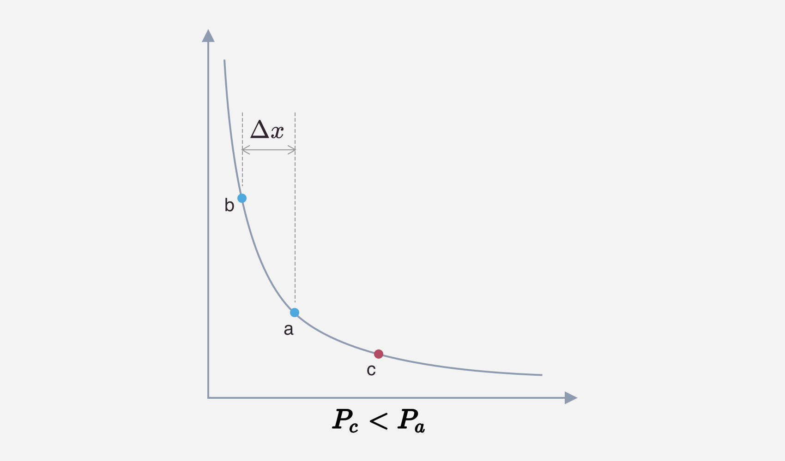
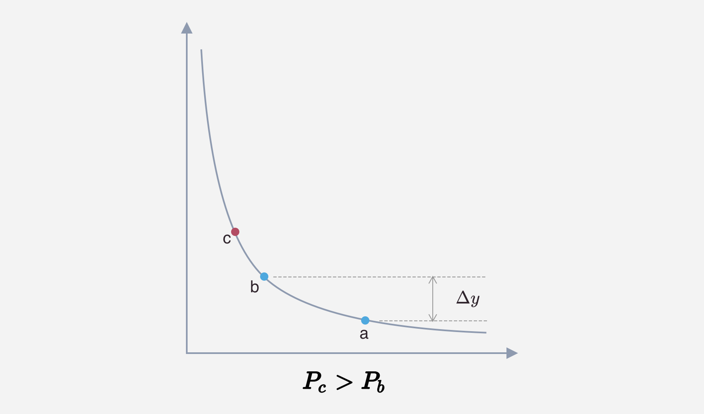
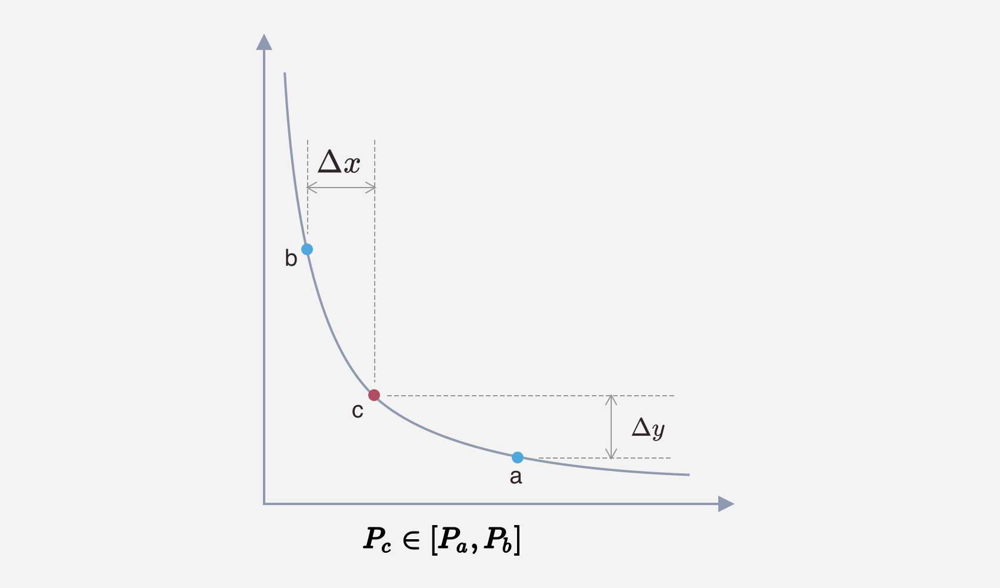

前文已经说过 Uniswap v3 的[代码架构](/uniswap-v3-1/#代码架构)。一般来说，用户的操作都是从 [uniswap-v3-periphery](https://github.com/Uniswap/uniswap-v3-periphery) 中的合约开始。

## 创建交易对

创建交易对的调用流程如下：


用户首先调用 `NonfungiblePositionManager` 合约的 `createAndInitializePoolIfNecessary` 方法创建交易对，传入的参数为交易对的 token0, token1, fee 和初始价格 $\sqrt P$.

`NonfungiblePositionManager` 合约内部通过调用 `UniswapV3Factory` 的 `createPool` 方法完成交易对的创建，然后对交易对进行初始化，初始化的作用就是给交易对设置一个初始的价格。

`createAndInitializePoolIfNecessary` 如下：

```solidity
function createAndInitializePoolIfNecessary(
    address tokenA,
    address tokenB,
    uint24 fee,
    uint160 sqrtPriceX96
) external payable returns (address pool) {
    pool = IUniswapV3Factory(factory).getPool(tokenA, tokenB, fee);

    if (pool == address(0)) {
        pool = IUniswapV3Factory(factory).createPool(tokenA, tokenB, fee);
        IUniswapV3Pool(pool).initialize(sqrtPriceX96);
    } else {
        (uint160 sqrtPriceX96Existing, , , , , , ) = IUniswapV3Pool(pool).slot0();
        if (sqrtPriceX96Existing == 0) {
            IUniswapV3Pool(pool).initialize(sqrtPriceX96);
        }
    }
}
```

首先调用 `UniswapV3Factory.getPool` 方法查看交易对是否已经创建，`getPool` 函数是 solidity 自动为 `UniswapV3Factory` 合约中的状态变量 `getPool` 生成的外部函数，`getPool` 的数据类型为：

```solidity
contract UniswapV3Factory is IUniswapV3Factory, UniswapV3PoolDeployer, NoDelegateCall {
    ...
    mapping(address => mapping(address => mapping(uint24 => address))) public override getPool;
    ...
}
```

使用 3个 map 说明了 v3 版本使用 `(tokenA, tokenB, fee)` 来作为一个交易对的键，即相同代币，不同费率之间的流动池不一样。另外对于给定的 `tokenA` 和 `tokenB`，会先将其地址排序，将地址值更小的放在前，这样方便后续交易池的查询和计算。

再来看 `UniswapV3Factory` 创建交易对的过程，实际上它是调用 `deploy` 函数完成交易对的创建：

```solidity
function deploy(
    address factory,
    address token0,
    address token1,
    uint24 fee,
    int24 tickSpacing
) internal returns (address pool) {
    parameters = Parameters({factory: factory, token0: token0, token1: token1, fee: fee, tickSpacing: tickSpacing});
    pool = address(new UniswapV3Pool{salt: keccak256(abi.encode(token0, token1, fee))}());
    delete parameters;
}
```

这里的 `fee` 和 `tickSpacing` 是和费率及价格最小间隔相关的设置，这里只关注创建过程，费率和 tick 的实现后面再来做介绍。

### CREATE2

创建交易对，就是创建一个新的合约，作为流动池来提供交易功能。创建合约的步骤是：

```solidity
pool = address(new UniswapV3Pool{salt: keccak256(abi.encode(token0, token1, fee))}());
```

这里先通过 `keccak256(abi.encode(token0, token1, fee)` 将 `token0`, `token1`, `fee` 作为输入，得到一个哈希值，并将其作为 `salt` 来创建合约。因为指定了 `salt`, solidity 会使用 EVM 的 `CREATE2` 指令来创建合约。使用 `CREATE2` 指令的好处是，只要合约的 `bytecode` 及 `salt` 不变，那么创建出来的地址也将不变。

关于使用 salt 创建合约的解释：[Salted contract creations / create2](https://docs.soliditylang.org/en/latest/control-structures.html#salted-contract-creations-create2)

> `CREATE2` 指令的具体解释可以参考：[EIP-1014](https://eips.ethereum.org/EIPS/eip-1014)。solidity 在 0.6.2 版本后在语法层面支持了 `CREATE2`. 如果使用更低的版本，可以参考 [Uniswap v2](https://github.com/Uniswap/uniswap-v2-core/blob/4dd59067c76dea4a0e8e4bfdda41877a6b16dedc/contracts/UniswapV2Factory.sol#L28-L32) 的代码实现同样的功能。

使用 `CREATE2` 的好处是：

- 可以在链下计算出已经创建的交易池的地址
- 其他合约不必通过 `UniswapV3Factory` 中的接口来查询交易池的地址，可以节省 gas

不需要通过 `UniswapV3Factory` 的接口来计算交易池合约地址的方法，可以看[这段代码](https://github.com/Uniswap/uniswap-v3-periphery/blob/3514c56ccf84a2d32b623004e7c119494ac729cc/contracts/libraries/PoolAddress.sol#L15-L38)。

新交易对合约的构造函数中会反向查询 `UniswapV3Factory` 中的 parameters 值来进行初始变量的赋值：

```solidity
constructor() {
    int24 _tickSpacing;
    (factory, token0, token1, fee, _tickSpacing) = IUniswapV3PoolDeployer(msg.sender).parameters();
    tickSpacing = _tickSpacing;

    maxLiquidityPerTick = Tick.tickSpacingToMaxLiquidityPerTick(_tickSpacing);
}
```

为什么不直接使用参数传递来对新合约的状态变量赋值呢。这是因为 `CREATE2` 会将合约构造函数的参数和 salt 一起用来计算创建出的合约地址。如果创建合约需要指定参数，那么后续在计算合约地址时，还需要将这些创建时参数加入进去，这样会增加 off-chain 计算合约地址的复杂度。为了让合约地址的计算更简单（因为 `constructor` 没有参数，直接使用 `token0`, `token1`, `fee` 即可），`UniswapV3Pool` 的 `constructor()` 函数是没有参数的。


最后，对创建的交易对合约进行初始化：

```solidity
function initialize(uint160 sqrtPriceX96) external override {
    require(slot0.sqrtPriceX96 == 0, 'AI');

    int24 tick = TickMath.getTickAtSqrtRatio(sqrtPriceX96);

    (uint16 cardinality, uint16 cardinalityNext) = observations.initialize(_blockTimestamp());

    slot0 = Slot0({
        sqrtPriceX96: sqrtPriceX96,
        tick: tick,
        observationIndex: 0,
        observationCardinality: cardinality,
        observationCardinalityNext: cardinalityNext,
        feeProtocol: 0,
        unlocked: true
    });

    emit Initialize(sqrtPriceX96, tick);
}
```

初始化主要是设置了交易池的初始价格（注意，此时池子中还没有流动性），以及费率，tick 等相关变量的初始化。完成之后一个交易池就创建好了。

## 提供流动性

在合约内，v3 会保存所有用户的流动性，代码内称作 `Position`，提供流动性的调用流程如下：


用户还是首先和 `NonfungiblePositionManager` 合约交互。v3 这次将 LP token 改成了 ERC721 token，并且将 token 功能放到 `NonfungiblePositionManager` 合约中。这个合约替代用户完成提供流动性操作，然后根据将流动性的数据元记录下来，并给用户铸造一个 NFT Token.

省略部分非关键步骤，我们先来看添加流动性的函数：

```solidity
struct AddLiquidityParams {
    address token0;     // token0 的地址
    address token1;     // token1 的地址
    uint24 fee;         // 交易费率
    address recipient;  // 流动性的所属人地址
    int24 tickLower;    // 流动性的价格下限（以 token0 计价），这里传入的是 tick index
    int24 tickUpper;    // 流动性的价格上线（以 token0 计价），这里传入的是 tick index
    uint128 amount;     // 流动性 L 的值
    uint256 amount0Max; // 提供的 token0 上限数
    uint256 amount1Max; // 提供的 token1 上限数
}

function addLiquidity(AddLiquidityParams memory params)
    internal
    returns (
        uint256 amount0,
        uint256 amount1,
        IUniswapV3Pool pool
    )
{
    PoolAddress.PoolKey memory poolKey =
        PoolAddress.PoolKey({token0: params.token0, token1: params.token1, fee: params.fee});

    // 这里不需要访问 factory 合约，可以通过 token0, token1, fee 三个参数计算出 pool 的合约地址
    pool = IUniswapV3Pool(PoolAddress.computeAddress(factory, poolKey));

    (amount0, amount1) = pool.mint(
        params.recipient,
        params.tickLower,
        params.tickUpper,
        params.amount,
        // 这里是 pool 合约回调所使用的参数
        abi.encode(MintCallbackData({poolKey: poolKey, payer: msg.sender}))
    );

    require(amount0 <= params.amount0Max);
    require(amount1 <= params.amount1Max);
}
```

这里有几点值得注意：

- 传入的 lower/upper 价格是以 tick index 来表示的，因此需要在链下先计算好价格所对应的 tick index

- 传入的是流动性 $L$ 的大小，这个也需要在链下先计算好，计算过程见[下面](#从-token-数计算流动性-l)

- 我们不需要访问 factory 就可以计算出 pool 的地址，实现原理见 [CREATE2](#create2)

- 这里有一个回调函数的参数。v3 使用回调函数来完成进行流动性 token 的支付操作，原因见[下面](#回调函数)

### 从 token 数计算流动性 L

如前所述，因为合约的参数接受的是流动性 $L$ 的值，我们需要在链下通过用户愿意提供流动性包含的 token 数，计算出 $L$，~~这部分计算需要在前端界面预先算好~~, （2020.06.06 更新，在 uniswap 最新的代码中，简化了接口的参数，不在需要在链下预计算 L，这部分计算已经在合约中实现了，但是原理是不变的，为了保持本文的完整性，文本不再进行修改，关于 uniswap 合约和本文中代码的差异，可以在看完本文后看这个 [commit](https://github.com/Uniswap/uniswap-v3-periphery/commit/b6b885569786a319d853acc610ed03884fda9bee)）。

假设用户提供流动性的价格范围是：$[P_a, \ P_b]\ (P_a < P_b)$，代币池中的当前价格为 $P_c$，可以分成三种情况来计算流动性 $L$ 的值：

- 当前池中的价格 $P_{c} < P_{a}$ ，如下图：




此时添加的流动性全部为 x token，计算 $L$：

$$
L = \frac {\Delta x}{\frac 1{\sqrt {P_{a}}} - \frac 1{\sqrt {P_{b}}}}
$$

- 当前池中的价格 $P_{c} > P_{b}$



此时添加的流动性全部为 y token，计算 $L$：

$$
L = \frac {\Delta y}{\sqrt {P_{b}} - \sqrt {P_{a}}}
$$

- 当前池子中的价格 $P_{c} \in [P_{a}, P_{b}]$，如下图：



此时添加的流动性包含两个币种，可以通过任意一个 token 数量计算出 $L$:

$$
L = \frac {\Delta x}{\frac 1{\sqrt {P_{c}}} - \frac 1{\sqrt {P_{b}}}} = \frac {\Delta y}{\sqrt {P_{c}} - \sqrt {P_{a}}}
$$

### 回调函数

使用回调函数原因是，将 `Position` 的 owner 和实际流动性 token 支付者解耦。这样可以让中间合约来管理用户的流动性，并将流动性 token 化。关于 token 化，Uniswap v3 默认实现了 ERC721 token（因为即使是同一个池子，流动性之间差异也也很大）。

例如，当用户通过 `NonfungiblePositionManager` 来提供流动性时，对于 `UniswapV3Pool` 合约来说，这个 `Position` 的 owner 是 `NonfungiblePositionManager`，而 `NonfungiblePositionManager`  再通过 NFT Token 将 `Position` 与用户关联起来。这样用户就可以将 LP token 进行转账或者抵押类操作。

在 `NonfungiblePositionManager` 中回调函数的实现如下：

```solidity
struct MintCallbackData {
    PoolAddress.PoolKey poolKey;
    address payer;         // 支付 token 的地址
}

/// @inheritdoc IUniswapV3MintCallback
function uniswapV3MintCallback(
    uint256 amount0Owed,
    uint256 amount1Owed,
    bytes calldata data
) external override {
    MintCallbackData memory decoded = abi.decode(data, (MintCallbackData));
    CallbackValidation.verifyCallback(factory, decoded.poolKey);

    // 根据传入的参数，使用 transferFrom 代用户向 Pool 中支付 token
    if (amount0Owed > 0) pay(decoded.poolKey.token0, decoded.payer, msg.sender, amount0Owed);
    if (amount1Owed > 0) pay(decoded.poolKey.token1, decoded.payer, msg.sender, amount1Owed);
}
```

### postion 更新

接着我们看 `UniswapV3Pool` 是如何添加流动性的。流动性的添加主要在 `UniswapV3Pool._modifyPosition` 中，这个函会先调用 `_updatePosition` 来创建或修改一个用户的 `Position`，省略其中的非关键步骤：

```solidity
function _updatePosition(
    address owner,
    int24 tickLower,
    int24 tickUpper,
    int128 liquidityDelta,
    int24 tick
) private returns (Position.Info storage position) {
    // 获取用户的 Postion
    position = positions.get(owner, tickLower, tickUpper);
    ...

    // 根据传入的参数修改 Position 对应的 lower/upper tick 中
    // 的数据，这里可以是增加流动性，也可以是移出流动性
    bool flippedLower;
    bool flippedUpper;
    if (liquidityDelta != 0) {
        uint32 blockTimestamp = _blockTimestamp();

        // 更新 lower tikc 和 upper tick
        // fippedX 变量表示是此 tick 的引用状态是否发生变化，即
        // 被引用 -> 未被引用 或
        // 未被引用 -> 被引用
        // 后续需要根据这个变量的值来更新 tick 位图
        flippedLower = ticks.update(
            tickLower,
            tick,
            liquidityDelta,
            _feeGrowthGlobal0X128,
            _feeGrowthGlobal1X128,
            false,
            maxLiquidityPerTick
        );
        flippedUpper = ticks.update(
            tickUpper,
            tick,
            liquidityDelta,
            _feeGrowthGlobal0X128,
            _feeGrowthGlobal1X128,
            true,
            maxLiquidityPerTick
        );

        // 如果一个 tick 第一次被引用，或者移除了所有引用
        // 那么更新 tick 位图
        if (flippedLower) {
            tickBitmap.flipTick(tickLower, tickSpacing);
            secondsOutside.initialize(tickLower, tick, tickSpacing, blockTimestamp);
        }
        if (flippedUpper) {
            tickBitmap.flipTick(tickUpper, tickSpacing);
            secondsOutside.initialize(tickUpper, tick, tickSpacing, blockTimestamp);
        }
    }
    ...
    // 更新 position 中的数据
    position.update(liquidityDelta, feeGrowthInside0X128, feeGrowthInside1X128);

    // 如果移除了对 tick 的引用，那么清除之前记录的元数据
    // 这只会发生在移除流动性的操作中
    if (liquidityDelta < 0) {
        if (flippedLower) {
            ticks.clear(tickLower);
            secondsOutside.clear(tickLower, tickSpacing);
        }
        if (flippedUpper) {
            ticks.clear(tickUpper);
            secondsOutside.clear(tickUpper, tickSpacing);
        }
    }
}
```

先忽略费率相关的操作，这个函数所做的操作是：

- 添加/移除流动性时，先更新这个 Positon 对应的 lower/upper tick 中记录的元数据
- 更新 position
- 根据需要更新 tick 位图

Postion 是以 `owner`, `lower tick`, `uppper tick` 作为键来存储的，注意这里的 owner 实际上是 `NonfungiblePositionManager` 合约的地址。这样当多个用户在同一个价格区间提供流动性时，在底层的 `UniswapV3Pool` 合约中会将他们合并存储。而在 `NonfungiblePositionManager` 合约中会按用户来区别每个用户拥有的 `Position`.

Postion 中包含的字段中，除去费率相关的字段，只有一个即流动性 $L$：

```solidity
library Position {
    // info stored for each user's position
    struct Info {
        // 此 position 中包含的流动性大小，即 L 值
        uint128 liquidity;
        ...
    }
```

更新 position 只需要一行调用：

```solidity
position.update(liquidityDelta, feeGrowthInside0X128, feeGrowthInside1X128);
```

其中包含了 position 中流动性 $L$ 的更新，以及手续费相关的计算。

### tick 管理

我们再来看 tick 相关的管理，在 `UniswapV3Pool` 合约中有两个状态变量记录了 tick 相关的信息：

```solidity
    // tick 元数据管理的库
    using Tick for mapping(int24 => Tick.Info);
    // tick 位图槽位的库
    using TickBitmap for mapping(int16 => uint256);

    // 记录了一个 tick 包含的元数据，这里只会包含所有 Position 的 lower/upper ticks
    mapping(int24 => Tick.Info) public override ticks;
    // tick 位图，因为这个位图比较长（一共有 887272x2 个位），大部分的位不需要初始化
    // 因此分成两级来管理，每 256 位为一个单位，一个单位称为一个 word
    // map 中的键是 word 的索引
    mapping(int16 => uint256) public override tickBitmap;

library Tick {
    ...
    // tick 中记录的数据
    struct Info {
        // 记录了所有引用这个 tick 的 position 流动性的和
        uint128 liquidityGross;
        // 当此 tick 被越过时（从左至右），池子中整体流动性需要变化的值
        int128 liquidityNet;
        ...
    }
```

tick 中和流动性相关的字段有两个 `liquidityGross`，`liquidityNet`。

`liquidityNet` 表示当价格从左至右经过此 tick 时整体流动性需要变化的净值。在单个流动性中，对于 lower tick 来说，它的值为正，对于 upper tick 来说它的值为 负。

如果有两个 position 中的流动性相等，例如 `L = 500`，并且这两个 position 同时引用了一个 tick，其中一个为 lower tick ，另一个为 upper tick，那么对于这个 tick，它的 `liquidityNet = 0`。此时我们就需要有一种机制来判断一个 tick 是否仍然在被引用中。这里使用 `liquidityGross` 记录流动性的增值（不考虑 lower/upper），我们可以就通过流动性变化前后 `liquidityGross` 是否等于 0 来判断这个 tick 是否仍被引用。

当价格变动导致 $tick_{current}$ 越过一个 position 的 lower/upper tick 时，我们需要根据 tick 中记录的值来更新当前价格所对应的总体流动性。假设 position 的流动性值为 $\Delta L$，会有以下四种情况：

1. token0 价格上升，即从左至右越过一个 lower tick 时， $L=L_{current} + \Delta L$
2. token0 价格上升，即从左至右越过一个 upper tick 时， $L=L_{current} - \Delta L$
3. token0 价格下降，即从右至左越过一个 lower tick 时， $L=L_{current} + \Delta L$
4. token0 价格下降，即从右至左越过一个 lower tick 时， $L=L_{current} - \Delta L$

`liquidityNet` 中记录的就是当从左至右穿过这个 tick 时，需要增减的流动性，当其为 lower tick 时，其值为正，当其为 upper tick 时，其值为负。对于从右至左穿过的情况，只需将 `liquidityNet` 的值去翻即可完成计算。

我再来看如何更新 tick 元数据，以下是 `tick.update` 函数：

```solidity
function update(
    mapping(int24 => Tick.Info) storage self,
    int24 tick,
    int24 tickCurrent,
    int128 liquidityDelta,
    uint256 feeGrowthGlobal0X128,
    uint256 feeGrowthGlobal1X128,
    bool upper,
    uint128 maxLiquidity
) internal returns (bool flipped) {
    Tick.Info storage info = self[tick];

    uint128 liquidityGrossBefore = info.liquidityGross;
    uint128 liquidityGrossAfter = LiquidityMath.addDelta(liquidityGrossBefore, liquidityDelta);

    require(liquidityGrossAfter <= maxLiquidity, 'LO');

    // 通过 liquidityGross 在进行 position 变化前后的值
    // 来判断 tick 是否仍被引用
    flipped = (liquidityGrossAfter == 0) != (liquidityGrossBefore == 0);

    ...

    info.liquidityGross = liquidityGrossAfter;

    // 更新 liquidityNet 的值，对于 upper tick，
    info.liquidityNet = upper
        ? int256(info.liquidityNet).sub(liquidityDelta).toInt128()
        : int256(info.liquidityNet).add(liquidityDelta).toInt128();
}
```

此函数返回的 flipped 表示此 tick 的引用状态是否发生变化，之前的 `_updatePosition` 中的代码会根据这个返回值去更新 tick 位图。


### tick 位图

tick 位图用于记录所有被引用的 lower/upper tick index，我们可以用过 tick 位图，从当前价格找到下一个（从左至右或者从右至左）被引用的 tick index。关于 tick 位图的管理，在 `_updatePosition` 中的：

```solidity
if (flippedLower) {
    tickBitmap.flipTick(tickLower, tickSpacing);
    secondsOutside.initialize(tickLower, tick, tickSpacing, blockTimestamp);
}
if (flippedUpper) {
    tickBitmap.flipTick(tickUpper, tickSpacing);
    secondsOutside.initialize(tickUpper, tick, tickSpacing, blockTimestamp);
}
```

这里不做进一步的说明，具体代码实现在[TickBitmap库](https://github.com/Uniswap/uniswap-v3-core/blob/2dc1eb9f251bad1c260d22dd392d8cedb2c6a4b5/contracts/libraries/TickBitmap.sol)中。tick 位图有以下几个特性：

- 对于不存在的 tick，不需要初始值，因为访问 map 中不存在的 key 默认值就是 0
- 通过对位图的每个 word(uint256) 建立索引来管理位图，即访问路径为 word index -> word -> tick bit

### token 数确认

`_modifyPosition` 函数在调用 `_updatePosition` 更新完 Position 后，会计算出此次提供流动性具体所需的 x token 和 y token 数量。

```solidity
function _modifyPosition(ModifyPositionParams memory params)
    private
    noDelegateCall
    returns (
        Position.Info storage position,
        int256 amount0,
        int256 amount1
    )
{
    ...
    Slot0 memory _slot0 = slot0; // SLOAD for gas optimization

    position = _updatePosition(
        ...
    );

    ...
}
```

这里插入一个题外话，这一行代码：

```solidity
Slot0 memory _slot0 = slot0; // SLOAD for gas optimization
```

因为后续需要多次访问 `slot0`，这里将其读入内存中，后续的访问就可以使用 MLOAD 而不用使用 SLOAD，可以节省 gas（**SLOAD 的成本比 MLOAD 高很多**）。Uniswap v2 和 v3 大量使用了这个技巧。

这个函数在更新完 position 之后，主要做的就是通过 $L$ 和 $\Delta \sqrt P$ 计算出用户需要支付的 token 数量，我们之前已经讲过 [从 token 数计算流动性 L](/uniswap-v3-1/#从-token-数计算流动性-l)的三种情况，这里其实就是之前计算的逆运算，即通过 $L$ 计算 x token 和 y token 的数量，这里不再重复赘述其公式。具体代码如下：

```solidity
function _modifyPosition(ModifyPositionParams memory params)
    private
    noDelegateCall
    returns (
        Position.Info storage position,
        int256 amount0,
        int256 amount1
    )
{
    ...

    if (params.liquidityDelta != 0) {
        // 计算三种情况下 amount0 和 amount1 的值，即 x token 和 y token 的数量
        if (_slot0.tick < params.tickLower) {
            amount0 = SqrtPriceMath.getAmount0Delta(
                // 计算 lower/upper tick 对应的价格
                TickMath.getSqrtRatioAtTick(params.tickLower),
                TickMath.getSqrtRatioAtTick(params.tickUpper),
                params.liquidityDelta
            );
        } else if (_slot0.tick < params.tickUpper) {
            // current tick is inside the passed range
            uint128 liquidityBefore = liquidity; // SLOAD for gas optimization

            ...

            amount0 = SqrtPriceMath.getAmount0Delta(
                _slot0.sqrtPriceX96,
                TickMath.getSqrtRatioAtTick(params.tickUpper),
                params.liquidityDelta
            );
            amount1 = SqrtPriceMath.getAmount1Delta(
                TickMath.getSqrtRatioAtTick(params.tickLower),
                _slot0.sqrtPriceX96,
                params.liquidityDelta
            );

            liquidity = LiquidityMath.addDelta(liquidityBefore, params.liquidityDelta);
        } else {
            amount1 = SqrtPriceMath.getAmount1Delta(
                TickMath.getSqrtRatioAtTick(params.tickLower),
                TickMath.getSqrtRatioAtTick(params.tickUpper),
                params.liquidityDelta
            );
        }
    }
}
```

代码将计算的过程封装在了 `SqrtPriceMath` 库中，`getAmount0Delta` 和 `getAmount1Delta` 分别对应公式 $\Delta x = \Delta {\frac 1{\sqrt P}} \cdot L$ 和 $\Delta y = \Delta \sqrt P \cdot L$. 这两个函数中主要是封装了很多数学计算，Uniswap v3 参考[这里](https://xn--2-umb.com/21/muldiv/index.html)实现了一个精度较高的 $\frac {a \cdot b}c$ 的算法，封装在 `FullMath` 库中。


### tick index -> $\sqrt P$

上面的代码还使用了 `TickMath` 库中的 `getSqrtRatioAtTick` 来通过 tick index 计算其所对应的价格，实现为：

```solidity
function getSqrtRatioAtTick(int24 tick) internal pure returns (uint160 sqrtPriceX96) {
    uint256 absTick = tick < 0 ? uint256(-int256(tick)) : uint256(int256(tick));
    require(absTick <= uint256(MAX_TICK), 'T');

    // 这些魔数分别表示 1/sqrt(1.0001)^1, 1/sqrt(1.0001)^2, 1/sqrt(1.0001)^4....
    uint256 ratio = absTick & 0x1 != 0 ? 0xfffcb933bd6fad37aa2d162d1a594001 : 0x100000000000000000000000000000000;
    if (absTick & 0x2 != 0) ratio = (ratio * 0xfff97272373d413259a46990580e213a) >> 128;
    if (absTick & 0x4 != 0) ratio = (ratio * 0xfff2e50f5f656932ef12357cf3c7fdcc) >> 128;
    if (absTick & 0x8 != 0) ratio = (ratio * 0xffe5caca7e10e4e61c3624eaa0941cd0) >> 128;
    if (absTick & 0x10 != 0) ratio = (ratio * 0xffcb9843d60f6159c9db58835c926644) >> 128;
    if (absTick & 0x20 != 0) ratio = (ratio * 0xff973b41fa98c081472e6896dfb254c0) >> 128;
    if (absTick & 0x40 != 0) ratio = (ratio * 0xff2ea16466c96a3843ec78b326b52861) >> 128;
    if (absTick & 0x80 != 0) ratio = (ratio * 0xfe5dee046a99a2a811c461f1969c3053) >> 128;
    if (absTick & 0x100 != 0) ratio = (ratio * 0xfcbe86c7900a88aedcffc83b479aa3a4) >> 128;
    if (absTick & 0x200 != 0) ratio = (ratio * 0xf987a7253ac413176f2b074cf7815e54) >> 128;
    if (absTick & 0x400 != 0) ratio = (ratio * 0xf3392b0822b70005940c7a398e4b70f3) >> 128;
    if (absTick & 0x800 != 0) ratio = (ratio * 0xe7159475a2c29b7443b29c7fa6e889d9) >> 128;
    if (absTick & 0x1000 != 0) ratio = (ratio * 0xd097f3bdfd2022b8845ad8f792aa5825) >> 128;
    if (absTick & 0x2000 != 0) ratio = (ratio * 0xa9f746462d870fdf8a65dc1f90e061e5) >> 128;
    if (absTick & 0x4000 != 0) ratio = (ratio * 0x70d869a156d2a1b890bb3df62baf32f7) >> 128;
    if (absTick & 0x8000 != 0) ratio = (ratio * 0x31be135f97d08fd981231505542fcfa6) >> 128;
    if (absTick & 0x10000 != 0) ratio = (ratio * 0x9aa508b5b7a84e1c677de54f3e99bc9) >> 128;
    if (absTick & 0x20000 != 0) ratio = (ratio * 0x5d6af8dedb81196699c329225ee604) >> 128;
    if (absTick & 0x40000 != 0) ratio = (ratio * 0x2216e584f5fa1ea926041bedfe98) >> 128;
    if (absTick & 0x80000 != 0) ratio = (ratio * 0x48a170391f7dc42444e8fa2) >> 128;

    if (tick > 0) ratio = type(uint256).max / ratio;

    // this divides by 1<<32 rounding up to go from a Q128.128 to a Q128.96.
    // we then downcast because we know the result always fits within 160 bits due to our tick input constraint
    // we round up in the division so getTickAtSqrtRatio of the output price is always consistent
    sqrtPriceX96 = uint160((ratio >> 32) + (ratio % (1 << 32) == 0 ? 0 : 1));
}
```

这段代码的实现通过很多的 magic number，优化了计算过程，其实现思路如下：

首先我们知道：

$$
\sqrt P_i = {\sqrt {1.0001}}^i
$$

可以将 $i$ 拆解成如下形式，其中 $n_j$ 表示 $i$ 的二进制格式中第 $j$ 位的值：

$$
\begin{cases}
i = n_1 \cdot 1 + n_2 \cdot 2 + n_3 \cdot 4 + n_4 \cdot 8 + .... \\
n_i \in \{0, 1\}
\end{cases}
$$

例如 $i = 20 = 4 + 16$

然后我们可以有：

$$
\begin{cases}
\sqrt P = {\sqrt {1.0001}}^i = n_1{\sqrt {1.0001}}^1 \cdot n_2{\sqrt {1.0001}}^2 \cdot n_3{\sqrt {1.0001}}^4 \cdot n_4{\sqrt {1.0001}}^8 \cdot ... \\
n_i \in \{0, 1\}
\end{cases}
$$

因为 $i \in (-887272, 887272)$，只需要 20 位二进制数可以保存其值。我们可以预先算出 ${\sqrt {1.0001}}^1,\ {\sqrt {1.0001}}^2,\ {\sqrt {1.0001}}^4,\ ...,\ {\sqrt {1.0001}}^{524288}$ 的值（$524288=2^{19}$），然后将 $i$ 值每一位的值求出，带入上面的计算公式就可以算出 $\sqrt P_i$ 的值。

实际上，这段代码在上面的算法之上还进行了优化：

- 因为 $\sqrt P_{-i} = \frac 1{\sqrt P_{i}}$，所以当 $i$ 为负数时可以先将其取反，转换为正数进行计算
- 当 $i$ 的值为正数时，计算的结果可能会很大，中间计算涉及到很多乘法运算，可能会导致计算结果溢出（它使用了 `Q128.128` 定点数）。所以实际计算的是 $i$ 为负数时的值，因为当 $i$ 为负数时，$\sqrt P_{i}$ 是一个小于 1 的小数，这样在进行乘法运算时则不会产生溢出。即上面代码的那些魔数分别为 $\frac 1{\sqrt {1.0001}^1},\ \frac 1{\sqrt {1.0001}^2},\ \frac 1{\sqrt {1.0001}^4},\ \frac 1{\sqrt {1.0001}^4},\ ...,\ \frac 1{\sqrt {1.0001}^{524288}}$ 的值
- 这里的计算使用了 `Q128.128` 精度的定点数，实际上这些魔数的值都向右移动 128 位
- 最后，当输入是正数时，我们需要在计算的结尾计算 $\sqrt P_{i} = \frac 1{\sqrt P_{-i}}$，即 $\sqrt P_{i}$ 的倒数，这里因为使用了 `Q128.128` 精度的定点数，即计算的过程是： $\frac {1<<128}{\sqrt P_{-i}} << 128 = \frac {1<<256}{\sqrt P_{-i}}$，`1<<256` 可以使用 `type(uint256).max` 取近似值来表示
- 最后的最后，将 `Q128.128` 转换为 `Q64.96` 并始终向上取整，以保持一致性

### $\sqrt P$ -> tick index

这里顺带提一下，在交易计算中会需要进行上述计算的逆计算，给定 $\sqrt P$，需要计算出对应的 tick index，即 $log_{\sqrt {1.0001}}{\sqrt P}$ 的计算。在代码中为：`TickMath.getTickAtSqrtRatio`，关于这个函数的实现，可以参考我的这篇文章：[Solidity 中的对数计算](/logarithm-in-solidity/)。

### 完成流动性添加

`_modifyPosition` 调用完成后，会返回 x token, 和 y token 的数量。再来看 `UniswapV3Pool.mint` 的代码：

```solidity
function mint(
    address recipient,
    int24 tickLower,
    int24 tickUpper,
    uint128 amount,
    bytes calldata data
) external override lock returns (uint256 amount0, uint256 amount1) {
    require(amount > 0);
    (, int256 amount0Int, int256 amount1Int) =
        _modifyPosition(
            ModifyPositionParams({
                owner: recipient,
                tickLower: tickLower,
                tickUpper: tickUpper,
                liquidityDelta: int256(amount).toInt128()
            })
        );

    amount0 = uint256(amount0Int);
    amount1 = uint256(amount1Int);

    uint256 balance0Before;
    uint256 balance1Before;
    // 获取当前池中的 x token, y token 余额
    if (amount0 > 0) balance0Before = balance0();
    if (amount1 > 0) balance1Before = balance1();
    // 将需要的 x token 和 y token 数量传给回调函数，这里预期回调函数会将指定数量的 token 发送到合约中
    IUniswapV3MintCallback(msg.sender).uniswapV3MintCallback(amount0, amount1, data);
    // 回调完成后，检查发送至合约的 token 是否复合预期，如果不满足检查则回滚交易
    if (amount0 > 0) require(balance0Before.add(amount0) <= balance0(), 'M0');
    if (amount1 > 0) require(balance1Before.add(amount1) <= balance1(), 'M1');

    emit Mint(msg.sender, recipient, tickLower, tickUpper, amount, amount0, amount1);
}
```

这个函数关键的步骤就是通过回调函数，让调用方发送指定数量的 x token 和 y token 至合约中。

我们再来看 `NonfungiblePositionManager.mint` 的代码：

```solidity
function mint(MintParams calldata params)
    external
    payable
    override
    checkDeadline(params.deadline)
    returns (
        uint256 tokenId,
        uint256 amount0,
        uint256 amount1
    )
{
    IUniswapV3Pool pool;
    // 这里是添加流动性，并完成 x token 和 y token 的发送
    (amount0, amount1, pool) = addLiquidity(
        AddLiquidityParams({
            token0: params.token0,
            token1: params.token1,
            fee: params.fee,
            recipient: address(this),
            tickLower: params.tickLower,
            tickUpper: params.tickUpper,
            amount: params.amount,
            amount0Max: params.amount0Max,
            amount1Max: params.amount1Max
        })
    );

    // 铸造 ERC721 token 给用户，用来代表用户所持有的流动性
    _mint(params.recipient, (tokenId = _nextId++));

    bytes32 positionKey = PositionKey.compute(address(this), params.tickLower, params.tickUpper);
    (, uint256 feeGrowthInside0LastX128, uint256 feeGrowthInside1LastX128, , ) = pool.positions(positionKey);

    // idempotent set
    uint80 poolId =
        cachePoolKey(
            address(pool),
            PoolAddress.PoolKey({token0: params.token0, token1: params.token1, fee: params.fee})
        );

    // 用 ERC721 的 token ID 作为键，将用户提供流动性的元信息保存起来
    _positions[tokenId] = Position({
        nonce: 0,
        operator: address(0),
        poolId: poolId,
        tickLower: params.tickLower,
        tickUpper: params.tickUpper,
        liquidity: params.amount,
        feeGrowthInside0LastX128: feeGrowthInside0LastX128,
        feeGrowthInside1LastX128: feeGrowthInside1LastX128,
        tokensOwed0: 0,
        tokensOwed1: 0
    });
}
```

可以看到这个函数主要是将用户的 Position 保存起来，并给用户铸造 NFT token，代表其所持有的流动性。至此提供流动性的步骤就完成了。移除流动性就是上述操作的逆操作，本文不再赘述了。

### Update 05-23

关于如何使用 ERC-721 token 来进行挖矿，可以参考这篇文章：[Liquidity Mining on Uniswap v3](https://www.paradigm.xyz/2021/05/liquidity-mining-on-uniswap-v3/)

## Uniswap v3 详解系列
本系列所有文章：

- [Uniswap v3 详解（一）：设计原理](/uniswap-v3-1)
- [Uniswap v3 详解（二）：创建交易对/提供流动性](/uniswap-v3-2)
- [Uniswap v3 详解（三）：交易过程](/uniswap-v3-3)
- [Uniswap v3 详解（四）：交易手续费](/uniswap-v3-4)
- [Uniswap v3 详解（五）：Oracle 预言机](/uniswap-v3-5)
- [Uniswap v3 详解（六）：闪电贷](/uniswap-v3-6)
