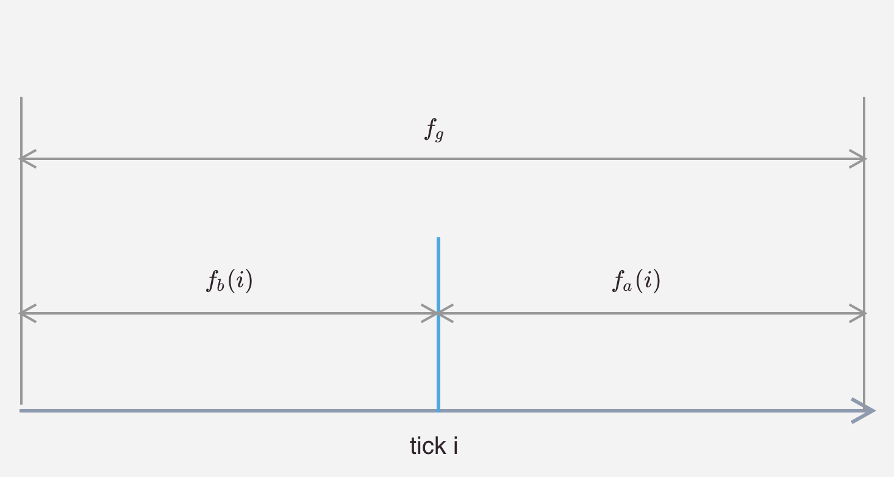
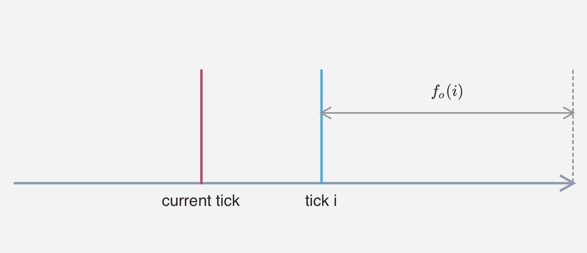
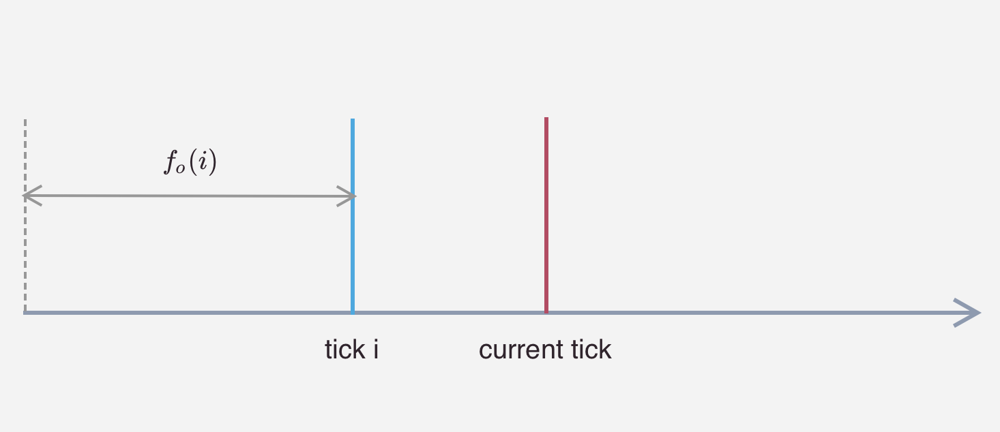

以普通用户的视角来看，对比 Uniswap v2，Uniswap v3 在手续费方面做了如下改动：

- 添加流动性时，手续费可以有 3个级别供选择：0.05%, 0.3% 和 1%，未来可以通过治理加入更多可选的手续费率
- Uniswap v2 中手续费会在收取后自动复投称为 LP 的一部分，即每次手续费都自动变成流动性加入池子中，而 Uniswap v3 中收取的手续费不会自动复投（主要是为了方便合约的计算），需要手动取出手续费
- 不同手续费级别，在添加流动性时，价格可选值的最小粒度也不一样（这个是因为 tick spacing 的影响），一般来说，手续费越低，价格可选值越精细，因此官方推荐价格波动小的交易对使用低费率（例如稳定币交易对）

以开发者的视角来看，Uniswap v3 的手续费计算相对会比较复杂， 因为它需要针对每一个 `position` 来进行单独的计算，为了方便计算，在代码中会将手续费相关的元数据记录在 `position` 的边界 tick 上（这些 tick 上还存储了 $\Delta L$ 等元数据）。

## 手续费的计算和存储

在之前的文章中说过，一个交易对池的流动性，是由不同的流动性组合而成，每一个流动性的提供者都可以设置独立的价格范围区间，这个被称为 `positon`. 当我们计算交易的手续费时，我们需要计算如下值：

- 每一个 `position` 收取的手续费（token0, token1 需要分别单独计算）
- 用户如果提取了手续费，需要记录用户已提取的数值

v3 中有以下几个关于手续费的变量：

- 交易池中手续费的费率值，这里记录的值时以 1000000 为基数的值，例如当手续费为 0.03% 时，费率值为 300
- 全局状态变量 `feeGrowthGlobal0X128` 和 `feeGrowthGlobal1X128` ，分别表示 token0 和 token1 所累计的手续费总额，使用了 `Q128.128` 浮点数来记录
- 对于每个 tick，记录了 `feeGrowthOutside0X128` 和 `feeGrowthOutside0X128`，这两个变量记录了发生在此 tick 「外侧」的手续费总额，那么什么「外侧」呢，后文会详细说明
- 对于每个 `position`，记录了此 `position` 内的手续费总额 `feeGrowthInside0LastX128` 和 `feeGrowthInside1LastX128`，这个值不需要每次都更新，它只会在 `position` 发生变动，或者用户提取手续费时更新

需要注意的时，上面这些手续费状态变量都是每一份 LP 所对应的手续费，在计算真正的手续费时，需要使用 LP 数相乘来得出实际手续费数额，又因为 LP 数在不同价格可能时不同的（因为流动性深度不同），所以在计算手续费时只能针对 `position` 进行计算（同一个 `position` 内 LP 总量不变）。

## 计算过程

我们用 $f_g$ 表示代币池收取的手续费总额，对于一个 tick，其索引为 $i$，使用 $f_o(i)$ 表示此 tick 「外侧」的手续费总额，使用 $f_b(i)$ 表示低于此 tick 价格发生的交易的手续费总额，使用 $f_a(i)$ 表示高于此 tick 价格发生的交易的手续费总额。



如上图所示，对于 tick(i)，有 $f_g = f_a(i) + f_b(i)$

### $f_o$ 的含义

$f_o$ 表示的是发生在此 tick $i$「外侧」的所有交易手续费总额。那么什么是「外侧」呢，外侧指的是与当前价格所对应的 tick 相对于 tick i 的相反侧。

$f_o(i)$ 与 tick $i_c$ 之间的关系：

- 当 $i_c < i$ 时，$f_o(i)  = f_a(i)$
- 当 $i_c \geq i$ 时，$f_o(i) = f_b(i)$

如下图所示：



可以看到，当前 tick 小于 tick i 时，$f_o(i)$ 即为大于 $i$ 所发生交易的手续费总和。



当前 tick 大于 tick i 时，$f_o(i)$ 即为小于 $i$ 所发生交易的手续费总和。

### 流动性价格区间中的手续费计算

有了 $f_o(i)$, $f_g$ 我们就可以计算出两个 tick 中间的手续费总和，这样就可以计算出某个 `position` 中发生交易的手续费总和。假设有两个 tick，价格较小的为 $i_l$ ，价格较高的为 $i_u$.

计算发生在 $[i_l, i_u]$ 区间的手续费：

$$
f_{i_l, i_u} = f_g - f_b(i_l) - f_a(i_u)
$$

上面公式可以看下面这张图来理解：


因此，在计算一个范围区间的手续费时，我们需要计算出 $f_a(i)$ 和 $f_b(i)$ 的值，这两个值都可以通过 $f_o(i)$ 计算出来，具体公式在白皮书中有描述，这里不进行赘述了。

### $f_o$ 的更新

我们知道了某一个 tick 的 $f_o(i)$ 的值，与当前 tick $i_c$ 和 $i$ 之间的位置关系有关（大于或者小于），在发生交易时，当前价格的 $i_c$ 是会不断变化的。因此，当 $i_c$ 和 $i$ 的位置关系发生了变化时，我们需要更新 $f_o(i)$ 的值。

具体来说，当前价格穿过某一个 tick 时，需要更新此 tick 上的 $f_o(i)$，更新的方式时将其值修改为另一侧的手续费总和，即：

$f_o(i) := f_g - f_o(i)$

## core 仓库代码分析

手续费计算的代码的计算主要出现在以下行为相关的代码中：

- 提供流动性时，需要初始化 tick 对应的 $f_o$ 值
- 发生交易时，需要更新 $f_g$
- 当交易过程中，当前价格穿过某一个 tick 时，需要更新此 tick 上的 $f_o$ 值
- 当流动性发生变动时，更新此 `position` 中手续费的总和

### 提供流动性

在添加流动性时，我们会初始化或更新此 `position` 对应的 lower/upper tick，在 `Tick.update` 函数中：

```solidity
function update(
    mapping(int24 => Tick.Info) storage self,
    int24 tick,
    int24 tickCurrent,
    int128 liquidityDelta,
    uint256 feeGrowthGlobal0X128,
    uint256 feeGrowthGlobal1X128,
    bool upper,
    uint128 maxLiquidity
) internal returns (bool flipped) {
    Tick.Info storage info = self[tick];

    // 获取此 tick 更新之前的流动性
    uint128 liquidityGrossBefore = info.liquidityGross;
    uint128 liquidityGrossAfter = LiquidityMath.addDelta(liquidityGrossBefore, liquidityDelta);

    ...

    // 如果 tick 在更新之前的 liquidityGross 为 0，那么表示我们本次为初始化操作
    // 这里会初始化 tick 中的 f_o
    if (liquidityGrossBefore == 0) {
        // by convention, we assume that all growth before a tick was initialized happened _below_ the tick
        if (tick <= tickCurrent) {
            info.feeGrowthOutside0X128 = feeGrowthGlobal0X128;
            info.feeGrowthOutside1X128 = feeGrowthGlobal1X128;
        }
    }
    ...
    info.liquidityGross = liquidityGrossAfter;
    ...
}
```

省略与手续费无关的代码，这个函数中主要做的时手续费的初始化，通过 `liquidityGross` 变量，可以知道一个 tick 是否在更新之前不存在。在初始化时，根据当前价格的 $i_c$ 与 $i$ 的位置关系，初始化方式分为：

$$
f_o :=
\begin{cases}
f_g \ \ (i_c \geq i) \\
0 \ \ (i_c < i)
\end{cases}
$$

在初始化时，上面的公式隐射了一个假定：我们假定此 tick 初始化前，所有交易都发生在低于 tick 价格的范围中。这个假设并不一定复合实际情况，但是在最终的计算中，因为涉及到 lower/upper tick 的减法，这样的假设并不会对最终结果造成误差。

### 交易过程中的手续费

[上一篇](/uniswap-v3-3)文章中讲过整个交易过程时分步进行的，每一步都在一个相同的流动性区间，那么手续费的计算也需要在每一步的交易中计算出这一步的手续费总数。在交易步骤的结构体中有定义：

```solidity
struct StepComputations {
    ...
    // 当前交易步骤的手续费
    uint256 feeAmount;
}
```

只计算一个值时因为，手续费只会在输入的 token 中收取，而不会在输出的 token 中重复收取。

计算过程在 `SwapMath.computeSwapStep` 中：

```solidty
function computeSwapStep(
    ...
)
    internal
    pure
    returns (
        ...
        uint256 feeAmount
    )
{
    ...
    if (exactIn) {
        // 在交易之前，先计算当价格移动到交易区间边界时，所需要的手续费
        // 即此步骤最多需要的手续费数额
        uint256 amountRemainingLessFee = FullMath.mulDiv(uint256(amountRemaining), 1e6 - feePips, 1e6);
        ...
    } else {
        ...
    }

    ...

    // 根据交易是否移动到价格边界来计算手续费的数额
    if (exactIn && sqrtRatioNextX96 != sqrtRatioTargetX96) {
        // 当没有移动到价格边界时（即余额不足以让价格移动到边界），直接把余额中剩余的资金全部作为手续费
        feeAmount = uint256(amountRemaining) - amountIn;
    } else {
        // 当价格移动到边界时，计算相应的手续费
        feeAmount = FullMath.mulDivRoundingUp(amountIn, feePips, 1e6 - feePips);
    }
}
```

以 0.03% 手续费为例，手续费的公式为：

$$
f = x_{in} \cdot 0.03\% = \frac {x_{in} \cdot 300 }{1000000}
$$

当一个交易步骤完成后，需要将这部分手续费更新到 $f_g$ 中，这部分在 `UniswapV3Pool.swap` 中：

```solidity
// 交易步骤的循环
while (state.amountSpecifiedRemaining != 0 && state.sqrtPriceX96 != sqrtPriceLimitX96) {
    // 计算这一步的手续费总额
    (state.sqrtPriceX96, step.amountIn, step.amountOut, step.feeAmount) = SwapMath.computeSwapStep(
        ...
    );

    // 更新交易的 f_g，这里需要除以流动性 L
    if (state.liquidity > 0)
        state.feeGrowthGlobalX128 += FullMath.mulDiv(step.feeAmount, FixedPoint128.Q128, state.liquidity);

    ...
 }

 ...

// 在交易步骤完成后，更新合约的 f_g
if (zeroForOne) {
    feeGrowthGlobal0X128 = state.feeGrowthGlobalX128;
    if (state.protocolFee > 0) protocolFees.token0 += state.protocolFee;
} else {
    feeGrowthGlobal1X128 = state.feeGrowthGlobalX128;
    if (state.protocolFee > 0) protocolFees.token1 += state.protocolFee;
}
...
```

更新时使用此步骤的手续费总额除以此步骤的流动性 $L$ ，以得出每一份流动性所对应的手续费数值。

### 当 tick 被穿过时

前面说过，当 tick 被穿过时，需要更新这个 tick 对应的 $f_o$，这部分操作也是在 `UniswapV3Pool.swap` 中：

```solidity
while (state.amountSpecifiedRemaining != 0 && state.sqrtPriceX96 != sqrtPriceLimitX96) {
    ...
    // 当价格到达当前步骤价格区间的边界时，可能需要穿过下一个 tick
    if (state.sqrtPriceX96 == step.sqrtPriceNextX96) {
        // 查看下一个 tick 是否初始化
        if (step.initialized) {
            int128 liquidityNet =
                // 在这里需要更新 tick 的 f_o
                ticks.cross(
                    step.tickNext,
                    (zeroForOne ? state.feeGrowthGlobalX128 : feeGrowthGlobal0X128),
                    (zeroForOne ? feeGrowthGlobal1X128 : state.feeGrowthGlobalX128)
                );
            // if we're moving leftward, we interpret liquidityNet as the opposite sign
            // safe because liquidityNet cannot be type(int128).min
            ...
        }

        ...
    } else if (state.sqrtPriceX96 != step.sqrtPriceStartX96) {
        ...
    }
    ...
}
```

这里通过 `ticks.cross` 来更新被穿过的 tick：

```
function cross(
    mapping(int24 => Tick.Info) storage self,
    int24 tick,
    uint256 feeGrowthGlobal0X128,
    uint256 feeGrowthGlobal1X128
) internal returns (int128 liquidityNet) {
    Tick.Info storage info = self[tick];
    info.feeGrowthOutside0X128 = feeGrowthGlobal0X128 - info.feeGrowthOutside0X128;
    info.feeGrowthOutside1X128 = feeGrowthGlobal1X128 - info.feeGrowthOutside1X128;
    liquidityNet = info.liquidityNet;
}
```

`tick.cross` 函数很简单，就是应用了[上面](#f_o-的更新)所说的公式：

$$
$f_o(i) := f_g - f_o(i)$
$$

tick 维度的手续费更新操作就全部完成了。

### position 维度

`position` 由 lower tick 和 upper tick 两个 tick 组成，当 positino 更新时，就可以更新从上次更新以来此 `position` 中累积的手续费数额。只在 `position` 的流动性更新时才更新 `position` 中的手续费可以让交易过程不用更新过多的变量，节省交易所消耗的 gas 费用。在 `UniswapV3Pool._updatePosition` 中：

```solidity
function _updatePosition(
    address owner,
    int24 tickLower,
    int24 tickUpper,
    int128 liquidityDelta,
    int24 tick
) private returns (Position.Info storage position) {
    ...

    // 计算出此 position 中的手续费总额
    (uint256 feeGrowthInside0X128, uint256 feeGrowthInside1X128) =
        ticks.getFeeGrowthInside(tickLower, tickUpper, tick, _feeGrowthGlobal0X128, _feeGrowthGlobal1X128);

    // 更新 position 中记录的值
    position.update(liquidityDelta, feeGrowthInside0X128, feeGrowthInside1X128);

    ...
}
```

通过 $i_{lower}$, $i_{upper}$, $i_{current}$ 和 $f_g$，调用 `ticks.getFeeGrowthInside` 可以计算出 position 中的手续费总额，代码为：

```
function getFeeGrowthInside(
    mapping(int24 => Tick.Info) storage self,
    int24 tickLower,
    int24 tickUpper,
    int24 tickCurrent,
    uint256 feeGrowthGlobal0X128,
    uint256 feeGrowthGlobal1X128
) internal view returns (uint256 feeGrowthInside0X128, uint256 feeGrowthInside1X128) {
    Info storage lower = self[tickLower];
    Info storage upper = self[tickUpper];

    // 计算 f_b(i)
    uint256 feeGrowthBelow0X128;
    uint256 feeGrowthBelow1X128;
    if (tickCurrent >= tickLower) {
        feeGrowthBelow0X128 = lower.feeGrowthOutside0X128;
        feeGrowthBelow1X128 = lower.feeGrowthOutside1X128;
    } else {
        feeGrowthBelow0X128 = feeGrowthGlobal0X128 - lower.feeGrowthOutside0X128;
        feeGrowthBelow1X128 = feeGrowthGlobal1X128 - lower.feeGrowthOutside1X128;
    }

    // 计算 f_a(i)
    uint256 feeGrowthAbove0X128;
    uint256 feeGrowthAbove1X128;
    if (tickCurrent < tickUpper) {
        feeGrowthAbove0X128 = upper.feeGrowthOutside0X128;
        feeGrowthAbove1X128 = upper.feeGrowthOutside1X128;
    } else {
        feeGrowthAbove0X128 = feeGrowthGlobal0X128 - upper.feeGrowthOutside0X128;
        feeGrowthAbove1X128 = feeGrowthGlobal1X128 - upper.feeGrowthOutside1X128;
    }

    feeGrowthInside0X128 = feeGrowthGlobal0X128 - feeGrowthBelow0X128 - feeGrowthAbove0X128;
    feeGrowthInside1X128 = feeGrowthGlobal1X128 - feeGrowthBelow1X128 - feeGrowthAbove1X128;
}
```

这部分代码使用前面说过的[公式](#流动性价格区间中的手续费计算)，这里不再详述。

在 `Position.update` 函数中：

```solidity
function update(
    Info storage self,
    int128 liquidityDelta,
    uint256 feeGrowthInside0X128,
    uint256 feeGrowthInside1X128
) internal
    ...
    // 计算 token0 和 token1 的手续费总数
    uint128 tokensOwed0 =
        uint128(
            FullMath.mulDiv(
                feeGrowthInside0X128 - _self.feeGrowthInside0LastX128,
                _self.liquidity,
                FixedPoint128.Q128
            )
        );
    uint128 tokensOwed1 =
        uint128(
            FullMath.mulDiv(
                feeGrowthInside1X128 - _self.feeGrowthInside1LastX128,
                _self.liquidity,
                FixedPoint128.Q128
            )
        );

    // update the position
    if (liquidityDelta != 0) self.liquidity = liquidityNext;
    self.feeGrowthInside0LastX128 = feeGrowthInside0X128;
    self.feeGrowthInside1LastX128 = feeGrowthInside1X128;
    if (tokensOwed0 > 0 || tokensOwed1 > 0) {
        // overflow is acceptable, have to withdraw before you hit type(uint128).max fees
        self.tokensOwed0 += tokensOwed0;
        self.tokensOwed1 += tokensOwed1;
    }
}
```

这里计算了此 `position` 自上次更新以来 token0 和 token1 的手续费总数，计算时使用的 `feeGrowthInside0X128` 的含义时每一份流动性所对应的手续费份额，因此在计算总额时需要使用此值乘以 `position` 的流动性总数。最后将这些手续费总数更新到 `tokensOwed0` 和 `tokensOwed0` 字段中。

### 手续费的提取

手续费的提取也是以 `position` 为单位进行提取的。使用 `UniswapV3Pool.collect` 提取手续费：

```solidity
function collect(
    address recipient,
    int24 tickLower,
    int24 tickUpper,
    uint128 amount0Requested,
    uint128 amount1Requested
) external override lock returns (uint128 amount0, uint128 amount1) {
    // 获取 position 数据
    Position.Info storage position = positions.get(msg.sender, tickLower, tickUpper);

    // 根据参数调整需要提取的手续费
    amount0 = amount0Requested > position.tokensOwed0 ? position.tokensOwed0 : amount0Requested;
    amount1 = amount1Requested > position.tokensOwed1 ? position.tokensOwed1 : amount1Requested;

    // 将手续费发送给用户
    if (amount0 > 0) {
        position.tokensOwed0 -= amount0;
        TransferHelper.safeTransfer(token0, recipient, amount0);
    }
    if (amount1 > 0) {
        position.tokensOwed1 -= amount1;
        TransferHelper.safeTransfer(token1, recipient, amount1);
    }

    emit Collect(msg.sender, recipient, tickLower, tickUpper, amount0, amount1);
}
```

这个函数比较简单，即根据 `position` 中已经记录的手续费和用户请求的数额，发送指定数额的手续费给用户。

但是这里 `posiiton` 中的手续费可能并不是最新的（上面说过手续费总数只会在 `position` 的流动性更新时更新）。因此在提取手续费前，需要主动触发一次手续费的更新，这些操作已经在 `uniswap-v3-periphery` 仓库中进行了封装。

## peirphery 仓库代码分析

### 流动性对应手续费的更新

`NonfungiblePositionManager` 中保存了用户提供的流动性，并使用 NFT token 将这个流动性代币化。在更新流动性时，也会更新其累积的手续费数额，例如增加流动性时：

```solidity
function increaseLiquidity(
    uint256 tokenId,
    uint128 amount,
    uint256 amount0Max,
    uint256 amount1Max,
    uint256 deadline
) external payable override checkDeadline(deadline) returns (uint256 amount0, uint256 amount1) {
    ...
    (, uint256 feeGrowthInside0LastX128, uint256 feeGrowthInside1LastX128, , ) = pool.positions(positionKey);

    // 更新 token0 和 tokne1 累积的手续费
    position.tokensOwed0 += uint128(
        FullMath.mulDiv(
            feeGrowthInside0LastX128 - position.feeGrowthInside0LastX128,
            position.liquidity,
            FixedPoint128.Q128
        )
    );
    position.tokensOwed1 += uint128(
        FullMath.mulDiv(
            feeGrowthInside1LastX128 - position.feeGrowthInside1LastX128,
            position.liquidity,
            FixedPoint128.Q128
        )
    );

    position.feeGrowthInside0LastX128 = feeGrowthInside0LastX128;
    position.feeGrowthInside1LastX128 = feeGrowthInside1LastX128;
    position.liquidity += amount;
}
```

因此一个流动性对应 NFT token 的手续费也会在流动性变化时更新。

### 提取手续费

提取手续费使用 `NonfungiblePositionManager.collet`：

```solidity
function collect(
    uint256 tokenId,
    address recipient,
    uint128 amount0Max,
    uint128 amount1Max
) external payable override isAuthorizedForToken(tokenId) returns (uint256 amount0, uint256 amount1) {
    require(amount0Max > 0 || amount1Max > 0);
    // 查询 postion 信息
    Position storage position = _positions[tokenId];

    PoolAddress.PoolKey memory poolKey = _poolIdToPoolKey[position.poolId];

    IUniswapV3Pool pool = IUniswapV3Pool(PoolAddress.computeAddress(factory, poolKey));

    (uint128 tokensOwed0, uint128 tokensOwed1) = (position.tokensOwed0, position.tokensOwed1);

    // 这里会再次更新一次手续费累计总额
    if (position.liquidity > 0) {
        // 使用 pool.burn() 来触发手续费的更新
        pool.burn(position.tickLower, position.tickUpper, 0);
        (, uint256 feeGrowthInside0LastX128, uint256 feeGrowthInside1LastX128, , ) =
            pool.positions(PositionKey.compute(address(this), position.tickLower, position.tickUpper));

        tokensOwed0 += uint128(
            FullMath.mulDiv(
                feeGrowthInside0LastX128 - position.feeGrowthInside0LastX128,
                position.liquidity,
                FixedPoint128.Q128
            )
        );
        tokensOwed1 += uint128(
            FullMath.mulDiv(
                feeGrowthInside1LastX128 - position.feeGrowthInside1LastX128,
                position.liquidity,
                FixedPoint128.Q128
            )
        );

        position.feeGrowthInside0LastX128 = feeGrowthInside0LastX128;
        position.feeGrowthInside1LastX128 = feeGrowthInside1LastX128;
    }

    // 提取手续费的最大值，不能超过手续费总额
    (amount0Max, amount1Max) = (
        amount0Max > tokensOwed0 ? tokensOwed0 : amount0Max,
        amount1Max > tokensOwed1 ? tokensOwed1 : amount1Max
    );

    // 调用 pool.collect 将手续费发送给 recipient
    (amount0, amount1) = pool.collect(recipient, position.tickLower, position.tickUpper, amount0Max, amount1Max);

    // sometimes there will be a few less wei than expected due to rounding down in core, but we just subtract the full amount expected
    // instead of the actual amount so we can burn the token
    (position.tokensOwed0, position.tokensOwed1) = (tokensOwed0 - amount0Max, tokensOwed1 - amount1Max);
}
```

这个函数就是先用 `pool.burn` 函数来触发 pool 中 `position` 内手续费总额的更新，使其更新为当前的最新值。调用时传入参数的 Liquidity 为 0，表示只是用来触发手续费总额的更新，并没有进行流动性的更新。更新完成后，再调用 `pool.collect` 提取手续费。

至此手续费相关的管理就全部介绍完了。uniswap 中通过类似手续费计算的方式，还记录了一个 `position` 中发生交易的总时长，用于 oracle 的计算，感兴趣的读者可以自行研究，后续我也会 oracle 相关的文章中也会介绍这部分内容。


## Uniswap v3 详解系列
本系列所有文章：

- [Uniswap v3 详解（一）：设计原理](/uniswap-v3-1)
- [Uniswap v3 详解（二）：创建交易对/提供流动性](/uniswap-v3-2)
- [Uniswap v3 详解（三）：交易过程](/uniswap-v3-3)
- [Uniswap v3 详解（四）：交易手续费](/uniswap-v3-4)
- [Uniswap v3 详解（五）：Oracle 预言机](/uniswap-v3-5)
