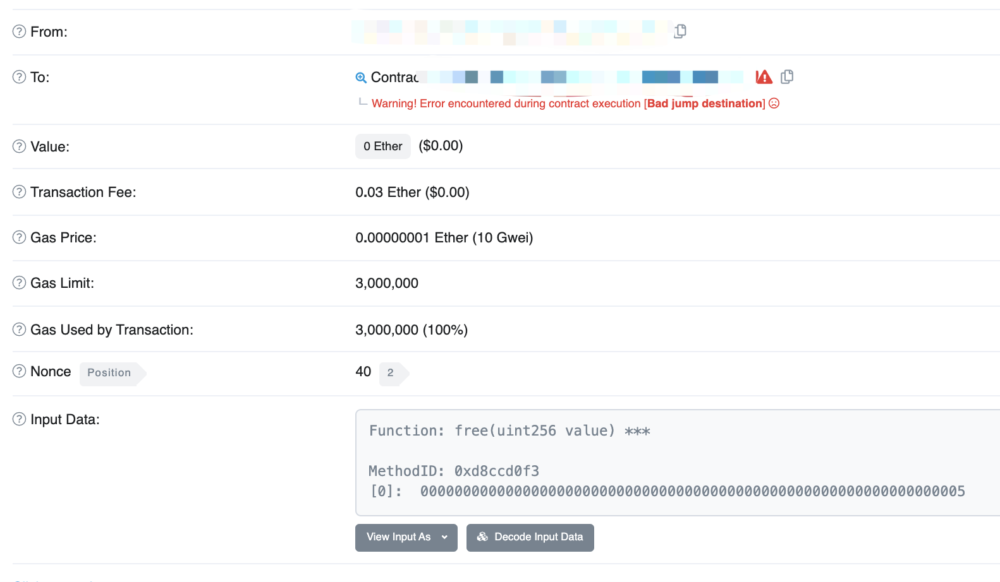
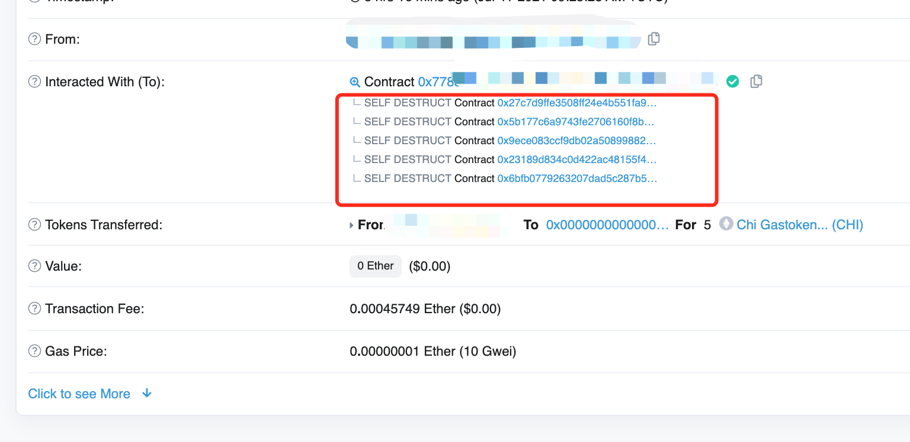

Fork CHI gastoken 的想法来自于和一位网友的对话。这位网友打算 fork 一个自己的 CHI gastoken，并优化其中的某些步骤，来让自己的合约的 gas 开销更加低一些。但是他在 fork CHI 代码部署之后，却发现无法成功执行 `CHI.free()` 操作。正好我在之前学习 gastoken 原理的时候看过 CHI 的具体实现，就尝试帮他解决了这个问题。

我觉得这个任务还是蛮具有挑战性的（其实可以作为一个面试/笔试实操题目？），需要对 EVM 指令，内存布局，合约地址，call 调用等细节都有一定的了解，因此在这里记录下整个过程。

# What is gastoken

以太坊上所有的智能合约，都是编译成 EVM 指令来运行的，在运行的过程中，根据指令的开销不同，会向用户收取不同数量的 gas，调用合约所运行的指令需要花费的 gas 总和就是交易所需要的 gas 总和。gastoken 就是一种可以用来降低交易 gas 开销的特殊 token，它利用了以太坊在早期设计的一个 gas 折扣规则来实现降低 gas 开销。

我们知道合约中的数据，都是永久保存在链上的，随着区块链运行的时间越久，链上所保存的数据也就越多，但是这些数据很多可能都是无效的数据。在以太坊设计时，为了鼓励开发者将没用的数据和合约清理掉，如果在交易中对合约进行销毁（`SELFDESTRUCT`）或者将合约存储 slots 中的数据清空（`SSTORE[x] = 0`），都可以获得 gas 折扣，即在原先要消耗的 gas 基础上打一个折扣，这样交易的 gas 开销就变小了。

于是就有开发者利用这个规则，开发出了各种 gastoken. 他们的原理大同小异，都是允许用户在 gas price 比较低的时候 `mint` gastoken，然后在 gas price 较高时将 gastoken `burn` 掉，这样就可以在高 gas price 时节省 gas 开销。

那么 gastoken 的 `mint` 和 `burn` 背后又会执行什么操作呢？对于 `mint` 操作，一般来说，合约会创建一些新的合约，或者向 slots 中写入一些无效的数据。反之，在 `burn` 操作时，又会将之前创建的合约销毁掉，或者将存储空间中的数据清零。

gastoken 实际上是滥用了以太坊的 refund 机制，因此以太坊在未来也将移除掉这个 refund 机制，gastoken 将不再有效，具体可以参考：[EIP-3298: Removal of refunds](https://eips.ethereum.org/EIPS/eip-3298)

# Why use gastoken

gas token 一般在以下场景使用：

1. 使用 high gas price 来抢先打包交易。这种场景使用 gas token 可以减少总体的 gas 消耗，矿工一般不会实际模拟这些交易，而是直接按 gas price 来打包
2. 使用 flashbots 时，降低 gas 的占用。这种场景使用 gas token 可以让那个自己的交易 gas 消耗更少，虽然 miner bribe 不会变少，但是会给矿工打包区块节省 gas（区块的 gas 是有上限的），因此能增加 bundle 的竞争力
3. 在 gas 很高的时候，用 gas token 降低开销。这种场景需要调用的合约支持使用 gas token
4. 因为 gastoken 是有价值的（可以交易），矿工在需要出空块的时候（为了快速打包区块他们有时候会出空块），可以选择全部 mint gastoken，参考[这篇文章](https://compassmining.io/education/empty-blocks-gas-chi-tokens-ether-pools-mining/)

# CHI gastoken

CHI gastoken 是 gastoken 的一种，由 1inch 开发，它比其他的一些 gastoken 会更加高效精简一些，具体介绍可以参考 [Everything you wanted to know about Chi Gastoken](https://blog.1inch.io/everything-you-wanted-to-know-about-chi-gastoken-a1ba0ea55bf3).

CHI 的工作原理也是允许用户 `mint` 和 `free` CHI token. 在 `mint` 时会根据指定的数量创建一系列的子合约，在 `free` 时会将之前创建的子合约销毁掉。下面我们参考它的源代码来讲解一下它的工作流程，这里我们参考 etherscan 上开源的代码：[https://etherscan.io/address/0x0000000000004946c0e9F43F4Dee607b0eF1fA1c#contracts](https://etherscan.io/address/0x0000000000004946c0e9F43F4Dee607b0eF1fA1c#contracts)，这份代码和其 [GitHub](https://github.com/1inch/chi/blob/master/contracts/ChiToken.sol) 上的最新代码会略有不同（GitHub 上的代码使用了更多的 inline assembly）。

## mint gastoken

使用合约的 `mint(uint256 value)` 可以用来 `mint` CHI token.

```solidity
function mint(uint256 value) public {
    uint256 offset = totalMinted;
    assembly {
        mstore(0, 0x746d4946c0e9F43F4Dee607b0eF1fA1c3318585733ff6000526015600bf30000)

        for {let i := div(value, 32)} i {i := sub(i, 1)} {
            pop(create2(0, 0, 30, add(offset, 0))) pop(create2(0, 0, 30, add(offset, 1)))
            pop(create2(0, 0, 30, add(offset, 2))) pop(create2(0, 0, 30, add(offset, 3)))
            // ...省略类似代码
            pop(create2(0, 0, 30, add(offset, 30))) pop(create2(0, 0, 30, add(offset, 31)))
            offset := add(offset, 32)
        }

        for {let i := and(value, 0x1F)} i {i := sub(i, 1)} {
            pop(create2(0, 0, 30, offset))
            offset := add(offset, 1)
        }
    }

    _mint(msg.sender, value);
    totalMinted = offset;
}
```

`mint(uint256 value)` 的接收参数表示需要 mint 的 gastoken 数量。在函数中会使用循环，调用 `create2` 创建子合约。这里使用了 `create2` 指令来创建子合约，这样做的目的是，后续可以通过计算，来计算出子合约的地址。关于 `create2` 指令，可以参考 [EIP-1014](https://eips.ethereum.org/EIPS/eip-1014)。在 Yul 中，`create2` 函数接收的 4 个参数的意义分别表示：

1. 创建合约调用时传入的 value（wei）
2. 内存中 `initcode` 的起始地址
3. 内存中 `initcode` 的结束地址
4. salt

这里会使用 `offset+i` 的方式构造不同的 salt 来创建合约，以保证每一个合约的地址都是唯一的。并且能够方便的用这个 salt 反向计算出创建出的合约地址。通过 `CREATE2` 这种方式创建子合约，CHI 合约就不用存储创建过的每一个合约地址了，这样做极大的节省了需要存储的空间。

那么创建的 `initcode` 又是什么呢？其实就包含在这一段代码中：

```solidity
mstore(0, 0x746d4946c0e9F43F4Dee607b0eF1fA1c3318585733ff6000526015600bf30000)
```

这里将一个 32byte 的字节载入到了内存中的 0 地址上。这一段 32byte 的字节就是编译好之后的 `initcode`，实际上它之后 30byte，最后的 `0000` 仅为了填充所使用。那么内存中 0 ～ 30 byte 的内容就是我们创建合约的 `initcode` 了。在创建合约时，会在新合约的地址空间上直接运行 `initcode`，`initcode` 通常会返回一串字节流，这串字节流就是这个地址上合约的 `bytecode`，它会被永久保存在链上，后续所有对新合约的调用都会运行这段 `bytecode`.

简单来说：

-   `initcode`，有时也被称作 `runtime code`，就是创建新合约时运行的代码，它只会运行一次，在 solidity 中通常被用来运行 `constructor` 函数的代码
-   `bytecode` 是调用已创建合约时运行的代码，它会永久保存在链上（除非调用 `SELFDESTRUCT` 销毁合约）

### `initcode`

那么这段 `initcode` 又做了什么呢？我们将它解码成 evm 指令来看一下（这里用的 [Online Solidity Decompiler](https://ethervm.io/decompile) 这个工具）：

```solidity
0000    74  PUSH21 0x6d4946c0e9f43f4dee607b0ef1fa1c3318585733ff
0016    60  PUSH1 0x00
0018    52  MSTORE
0019    60  PUSH1 0x15
001B    60  PUSH1 0x0b
001D    F3  *RETURN
```

这里第一列表示指令的偏移量，第二列表示指令的 opcode 码，最后表示指令的内容。这一段 `initcode` 其实只做了一件事，就是把 `6d4946c0e9f43f4dee607b0ef1fa1c3318585733ff` 这段字节加载到内存中，然后调用 `RETURN` 将这段字节返回。这段字节码就会作为新创建合约的 `bytecode` 被保存在链上了。

我们可以详细分析运行过程中 EVM 堆栈的情况：

首先，执行 `PUSH21` 和 `PUSH1`，此时栈空间内容为：

```solidity
[STACK]
0: 0x0000000000000000000000000000000000000000000000000000000000000000
1: 0x00000000000000000000006d4946c0e9f43f4dee607b0ef1fa1c3318585733ff
```

然后执行 `MSTORE`，它会将栈 1 中的字节流存储到栈 0 中指定的内存地址中，执行完成后栈空间就被清空了，而内存空间为：

```solidity
[MEMORY]
0x0: 0x00000000000000000000006d4946c0e9f43f4dee607b0ef1fa1c3318585733ff
```

最后我们要将内存中内存地址 `[11, 32)` 的代码返回，从内存地址 11 开始，是因为需要跳过首部 11 个 byte 的 `0`. 因此最后几行指令可以翻译成 Yul 代码 `return(11, 21)`，即将内存中 `[11, 32)` 中的值返回，这里返回的就是创建合约的 `bytecode` ，也就是 `mint` 操作创建的新合约的 `bytecode`。之后这段 `initcode` 运行结束，它所返回的 `bytecode` 被存储到合约地址中。

### `bytecode`

那么这段 `bytecode` 又包含了什么指令呢？我们继续解码这段 `bytecode`（仍然使用 [Online Solidity Decompiler](https://ethervm.io/decompile)）：

```solidity
0000    6D  PUSH14 0x4946c0e9f43f4dee607b0ef1fa1c
000F    33  CALLER
0010    18  XOR
0011    58  PC
0012    57  *JUMPI
0013    33  CALLER
0014    FF  *SELFDESTRUCT
```

这段 `bytecode` 要做的事情其实很简单：

1. 使用 `XOR` 将 caller 地址与 `0x000000000000004946c0e9f43f4dee607b0ef1fa1c` 进行比较
2. 将 Program Counter 记录到栈上
3. 如果 `XOR` 结果不为 0，那么会使用 `JUMPI` 进行跳转，但是因为没有合法的 `JUMPDEST`，这个指令会直接 `revert`，并且消耗光所有的剩余 gas
4. 如果`XOR` 结果为 0，那么代码回不进行跳回，而会继续执行到 `SELFDESTRUCT` 指令，合约将被销毁

因为这是一段手工编写的 opcode，它并没有 solidity 编译后的 opcodes 那么复杂，这样也节省了很多的运行开销。

这里的 `0x000000000000004946c0e9f43f4dee607b0ef1fa1c` 就是 [CHI Gastoken](https://etherscan.io/address/0x0000000000004946c0e9F43F4Dee607b0eF1fA1c#contracts) 的地址。因此在写 CHI 代码时需要先计算出将要部署的合约的地址，然后将其填充到这段 `bytecode` 中。这里 1inch 计算出了一个以 `0x000000000000...` 起始的地址，这样可以让 `bytecode` 更加的精简，可以说是将优化进行到了极致。

在创建完成子合约之后，会通过 `_mint(msg.sender, value)` 给用户 `mint` token，作为销毁时的使用凭证。

## burn gastoken

在使用 gas token 时，CHI 提供了多个不同的 `burn` 方式，这里我们看最简单的一种：

```solidity
function computeAddress2(uint256 salt) public view returns (address) {
    bytes32 _data = keccak256(
        abi.encodePacked(bytes1(0xff), address(this), salt, bytes32(0x3c1644c68e5d6cb380c36d1bf847fdbc0c7ac28030025a2fc5e63cce23c16348))
    );
    return address(uint256(_data));
}

function _destroyChildren(uint256 value) internal {
    uint256 _totalBurned = totalBurned;
    for (uint256 i = 0; i < value; i++) {
        computeAddress2(_totalBurned + i).call("");
    }
    totalBurned = _totalBurned + value;
}

function free(uint256 value) public returns (uint256)  {
    _burn(msg.sender, value);
    _destroyChildren(value);
    return value;
}
```

调用 `free(uint256 value)` 就可以进行 gas token 的销毁。

函数内会首先调用 `_burn(msg.sender, value)` 将用户的 ERC20 token 销毁，然后调用 `_destroyChildren()` 来销毁子合约。销毁子合约时，先用 `computeAddress2` 计算出子合约的地址，在计算时，我们需要使用 `salt` 以及 `initcode` hash，这里的 `0x3c1644c68e5d6cb380c36d1bf847fdbc0c7ac28030025a2fc5e63cce23c16348` 就是 `initcode` hash，即：

```javascript
> utils.keccak256('0x746d4946c0e9F43F4Dee607b0eF1fA1c3318585733ff6000526015600bf3')
'0x3c1644c68e5d6cb380c36d1bf847fdbc0c7ac28030025a2fc5e63cce23c16348'
```

计算出子合约的地址后，会直接进行 `.call("")` 调用来销毁它：

```solidity
computeAddress2(_totalBurned + i).call("");
```

这里 `call` 调用会执行子合约中的代码，即在[bytecode](#bytecode)中讲解的代码，首先会对调用者进行检查，然后销毁合约。因为子合约中对调用者进行了检查，因此其他人即使知道你在 mint CHI gastoken 时创建的子合约地址，他们无法销毁你创建的子合约。因为子合约只可以被来源是 CHI 合约的地址所销毁。

# How to fork a CHI?

了解了 CHI 的工作原理之后，我们知道如果直接 fork CHI 的代码部署，会有一个问题是，CHI 中部署子合约所使用的 `bytecode` 硬编码了一个 `0x000000000000004946c0e9f43f4dee607b0ef1fa1c` 的地址，用来进行 `Caller` 地址检查，如果我们直接 fork CHI 的代码，这个硬编码地址将和 fork 后部署的合约地址不匹配，导致无法正确销毁 `mint` 时创建的子合约。

这里我首先使用测试网原封不动的 fork CHI 合约后部署，进行测试，在调用 `free()` burn 掉 CHI token 时，会产生以下错误：



错误提示是 `Bad jump destination`，即之前在 [bytecode](#bytecode) 中所讲的，`CALLER` 地址将与 `0x000000000000004946c0e9f43f4dee607b0ef1fa1c` 这个硬编码地址进行 `XOR` 比较，因为我 fork 后部署的 CHI 合约地址并不是这个地址，会导致比较的结果不为 0，然后会执行 `JUMPI`，进行了一个无效的跳转，导致 revert 并消耗完所有剩余 gas.

## Tackle the bytecode

为了我们 fork 的 CHI 合约能正常工作，我们需要将合约中硬编码的 bytecode 改写，将其中应硬编码的地址 `4946c0e9f43f4dee607b0ef1fa1c`（省略前面的 `0`）改成我们 fork 合约的地址。

这里 CHI 的合约地址因为是一个特殊地址（以 0 开头），在 `initcode` 中进行 PUSH 操作时可以省去前面的 `0`，因此它能够缩短 `initcode` 和 `bytecode` 的大小，并且节省 `PUSH` 操作的 gas 开销。这也是为什么很多 hacker 喜欢以 `0` 开头的账号，部署以 `0` 开头的合约的原因。

这里我为了方便，就不去暴力找寻能够产生以 `0` 开头合约地址的账号了。那么第一个任务就是预计算 fork 合约地址。

### Compute the contract address in advance

以太坊中合约一共有两种创建方式，第一种是使用 `CREATE` 指令，第二种是使用 `CREATE2` 指令。第二种方式在之前已经讲过，它只能在合约中使用。我们正常部署一个合约都是使用的第一种创建方式，这种方式创建的合约地址计算方式为：

```javascript
"0x" + utils.keccak256(rlp.encode([SENDER, NONCE])).slice(26);
```

即将 `sender` 地址和 `nonce` 使用 rlp 编码后进行 `keccak256` 计算，并取计算结果末尾的 20 个字节作为合约地址。那么我们在部署合约之前，将部署账号的地址和 next nonce 作为参数，就可以计算出即将部署的合约地址了。

这里我使用 [remix](http://remix.ethereum.org/) 来进行部署测试，我的部署账号地址为：`0x5B38Da6a701c568545dCfcB03FcB875f56beddC4`，因为之前没有执行过交易，因此下一次交易的 nonce 为 0，那么可以计算出即将部署的合约地址：

```javascript
> '0x' + utils.keccak256(rlp.encode(['0x5B38Da6a701c568545dCfcB03FcB875f56beddC4', '0x'])).slice(26)
'0xd9145cce52d386f254917e481eb44e9943f39138'
```

### Modify `initcode`

我们现在需要使用刚才计算的合约地址 `d9145cce52d386f254917e481eb44e9943f39138`， 替换掉原来的 `bytecode` 中 CHI 的地址 `4946c0e9f43f4dee607b0ef1fa1c`.

原始的 `initcode` 为：

```
746d(4946c0e9F43F4Dee607b0eF1fA1c)3318585733ff6000526015600bf30000
```

上面我用括号括起来的就是需要替换的地址。

参看这份 [EVM opcodes](https://github.com/crytic/evm-opcodes) 表，在这个地址前的指令是 `6d` 即 `PUSH14`. 因为 CHI 的地址前面有很多个 0（一共有 6 个 byte 的 0），而我生成的地址是一个非 0 开头的 20byte 地址，因此这个 `6d` 指令也需要改写成为 `73` 即 `PUSH20`.

改写完成后，代码成了这样：

```
74(73d9145cce52d386f254917e481eb44e9943f39138)3318585733ff6000526015600bf30000
```

为了方便比较，这里我还是将改动过的内容用括号括起来。

到这里还不够，来看第一个指令码 `74`，表示的是 `PUSH21`，即将原来长度为 21 字节的 `bytecode` push 到栈上。但是经过改写后，现在的 `bytecode` 长度增加了 6 个字节（因为新地址不是以 0 开头的了）。这里我们需要将原来的 `PUSH21` 改成 `PUSH27` 即 `7a`，改动后 `initcode` 为：

```
(7a73d9145cce52d386f254917e481eb44e9943f39138)3318585733ff6000526015600bf30000
```

改动后，在 `initcode` 运行时，我们就能正确将 `bytecode` push 到栈上了，但是我们还需要将这段 `bytecode` 正确从内存中返回。在之前 [initcode](#initcode) 的讲解中，我们知道 `initcode` 会使用 `MSTORE` 将栈上的这段 `bytecode` 保存到内存中，然后返回内存中对应的字节。在原始 `initcode` 运行时，新合约地址空间中 EVM 的内存布局为：

```
[MEMORY]
0x0: 0x00000000000000000000006d4946c0e9f43f4dee607b0ef1fa1c3318585733ff
```

现在我们进行了修改之后，这段 `initcode` 运行后 EVM 内存布局将为：

```
[MEMORY]
0x0 0x0000000000073d9145cce52d386f254917e481eb44e9943f391383318585733ff
```

可以看到，在返回时，需要返回字节流的起始内存地址和长度都发生了变化。即我们需要将原来的 `return(11, 21)` 修改为 `return(5, 27)`。那么需要对 `initcode` 末尾返回的 opcode 进行修改，即将 `15`(21) 改成 `1b`(27)，`0b`(11) 改成 `05`(5).

最终修改过后的 `initcode` 为：

```
(7a73d9145cce52d386f254917e481eb44e9943f39138)3318585733ff60005260(1b)60(05)f30000
```

去掉括号，即为：

```
7a73d9145cce52d386f254917e481eb44e9943f391383318585733ff600052601b6005f30000
```

### 修改 mstore 和 create2

现在我们替换掉了原始合约中的 `initcode`，还会出现一个新的问题，因为这段 byte 已经超过了 32 字节，无法用一个 `MSTORE` 存储了，那么我们需要将原始的单次 `MSTORE` 修改成 2 次 `MSTORE` 操作（这里再次体现了 0 开头地址的优势）。

原始代码：

```
mstore(0, 0x746d4946c0e9F43F4Dee607b0eF1fA1c3318585733ff6000526015600bf30000)
```

需要修改为：

```
mstore(0, 0x7a73d9145cce52d386f254917e481eb44e9943f391383318585733ff60005260)
msotre(32, 0x1b6005f300000000000000000000000000000000000000000000000000000000)
```

注意，第二次 `MSTORE` 的起始地址为 32，并且在末尾补零。顺带提一句，这里其实使用了 solidity 中预留给 hash 计算所使用的内存空间，但因为只是部署合约时临时使用，并不会出什么问题。但在 solidity 中其他用途需要使用 inline assembly 操作内存时，一定要遵守 solidity 的内存布局约定，否则可能造成无法预料的问题。关于 solidity 的 memory layout，可以参考：[Layout in Memory](https://docs.soliditylang.org/en/latest/internals/layout_in_memory.html).

因为 `bytecode` 长度变长了，我们还需要修改 `create2` 创建合约时指定的长度，原始合约中 `create2` 调用为：

```solidity
create2(0, 0, 30, add(offset, 0))
```

我们需要修改为：

```solidity
create2(0, 0, 36, add(offset, 0))
```

### 修改 `initcode` hash

`initcode` 修改了之后，在 `burn` token 时，用来计算子合约地址的 `initcode` hash 也需要随之修改，计算新 `initcode` 的 hash：

```javascript
> utils.keccak256('0x7a73d9145cce52d386f254917e481eb44e9943f391383318585733ff600052601b6005f3')
'0x7d69959a9f587c867b817f2a61b1385bc8a30e11e7f336616df1b23e35be5009'
```

将结果替换掉原来的 `initcode` hash：

```solidity
function computeAddress2(uint256 salt) public view returns (address) {
    bytes32 _data = keccak256(
        abi.encodePacked(bytes1(0xff), address(this), salt, bytes32(0x7d69959a9f587c867b817f2a61b1385bc8a30e11e7f336616df1b23e35be5009))
    );
    return address(uint256(_data));
}
```

### 完成修改

这样就完成了对 fork 合约的所有修改。这里我使用测试网测试了一下 `mint` 和 `burn` 操作，都可以正常使用了。下图是我调用 fork CHI 合约的 `free` 函数来销毁合约：



可以看到调用 `free` 函数成功销毁了合约，这个合约的地址是一个非 0 开头的地址（我在测试网部署的 fork 合约地址）。

到这里，fork CHI token 的所有流程就完成了，如果还有其他修改需求，就可以在这个修改后的合约之上来进行修改了。

Happy hacking!
