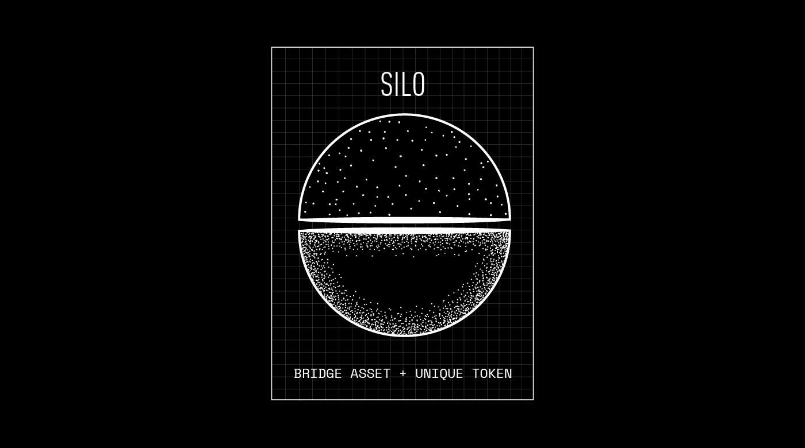
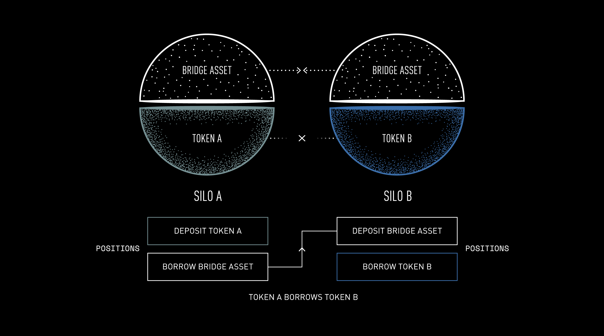

# 已有借贷协议的问题

## 资金效率和安全性之间的矛盾

以 COMP 和 AAVE 为首的借贷市场，都会以 DAO 的形式来管理借贷市场的可用的借贷资产。但是为了安全性，往往只有足够去中心化并且有足够多流动性的 token 可以被加入到借贷市场中。但是用户往往希望借贷平台上有更多的借贷代币。

由于 COMP/AAVE 中的借贷都是共享借贷池的，随着借贷市场中代币的增多，系统的安全性也会必然随之降低，即所谓木桶效应， 系统安全性取决于安全性最低的那个 token。

## 去中心化（permissionless）和无托管(non-custodial)

因为上述安全性的顾虑，借贷协议在增加新市场时需要经过 DAO 投票的治理流程，同时借贷市场中还有很多的市场参数（抵押率等）也需要 DAO 来进行投票决策。这无疑会增加借贷市场的人为维护成本，同时也让这些协议的扩展性受限，难以实现无托管（non-custodial）。

## 安全性

以 COMP/AAVE 为首的借贷市场，由于使用了共享的资金池，整个借贷市场的安全性取决于安全性最弱的那个代币市场（木桶效应）。如果这个市场出现漏洞被攻击，那么其他市场也会遭受损失，这里有一些攻击案例（发生在 COMP/AAVE fork 项目中）：

- BSC Venus 借贷平台中的 XVS（Venus 自己的代币）价格被操控（有消息称是 Venus 团队自己进行的市场操纵），导致整个平台遭受了 2亿美金的损失。（[$200 M Venus Protocol hack analysis](https://quillhashteam.medium.com/200-m-venus-protocol-hack-analysis-b044af76a1ae)）
- CREAM 遭受闪电贷攻击（攻击代币的 Oracle），导致平台遭受 1.3亿美金损失。（[Cream Finance Exploited in Flash Loan Attack Netting Over $100M](https://www.coindesk.com/business/2021/10/27/cream-finance-exploited-in-flash-loan-attack-worth-over-100m/)）

共享资金池的借贷市场，是以牺牲安全性为代价，来支持更多的可借贷代币的。随着支持的代币越来越多，整个平台的安全性将会显著降低。

## 解决方案

通常的解决方案时将借贷市场进行隔离：

- 以 sushiswap 的 [Kashi](https://app.sushi.com/lend) 为代表，Kashi 中每一个借贷市场是相互隔离的，当一个市场出安全事故时，不会影响到其他市场。因此可以支持创建任意的借贷对。但是这样设定同时造成了流动性的隔离，Kashi 的用户体验也因此受到影响，此产品并的市场反应并不好。
- [Euler](https://www.euler.finance) 是另一个尝试通过多级别隔离来提升安全性的借贷协议，协议通过对代币进行安全性级别划分来进行借贷风险的隔离，关于 Euler 可以参考：[Euler — 次世代的 DeFi 借貸協議](https://medium.com/perp-engineering-zh/euler-intro-e9a9daad7280)

# Silo 借贷协议

[Silo](https://resources.silo.finance/) 使用了全新的机制以实现安全性，无许可，无托管的目标。项目参加了 ETHGlobal2021 Hackathon，并获得 finalist, Chainlink Prize Pool 1st 等奖项（[Silo Finance ETH Global showcase](https://showcase.ethglobal.com/ethonline2021/silo-finance)）。

Silo 将协议中的资产分成两种类型，一种是普通的借贷资产，另一种则被称为 Bridge Asset. Silo 协议由 N 个互相隔离的借贷市场来组成。每一个借贷市场都包含 Bridge Asset 和一个唯一的借贷资产代币。

## 隔离性

Silo 中的市场都是互相隔离的，每一个市场包含一个 Bridge Asset（目前是 ETH） 和某种借贷资产（例如 USDC, UNI, SAND）。由于市场是互相隔离的，当某一个借贷市场中的代币出现问题时，仅该市场的资金会受到损失，其他市场不会受到损失。

## 无准入（permission-less）和无托管（non-custodial）

任何人都可以创建任意借贷市场，即某个代币与 Bridge Asset 组成的借贷市场。当市场创建后，任何人都可以向这个市场提供流动性（Bridge Asset 或借贷资产）。

当然，提供流动性并不是无风险的，因此流动性提供者在向某个市场提供流动性时，一定要考虑这个代币的系统性风险，例如代币的流动性是否充足（将影响清算），代币分配是否去中心化，代币的价格是否稳定等。

任何市场创建之后就可以直接被加入协议，无需经过冗长的治理。

## Bridge Asset

Bridge Asset 的作用是将多个市场连接起来，这有点类似于 Uniswap V1，通过 ETH 将多个交易对连接起来。silo 中的 bridge asset 也是 ETH.

上图中有两个借贷市场，分别是 A/ETH 和 B/ETH，他们互相隔离，但是又通过 ETH 作为 Bridge Asset 连接起来。当用户想通过 A 作为抵押品借贷 B token 时。协议会进行以下操作：

- 用户在 A/ETH 市场中存入 Token A 以借出 ETH
- 借出的 ETH 被存入到 B/ETH 市场中
- 在 B/ETH 市场中借出 Token B 并转入用户钱包

通过这样的设计，所有互相隔离的市场又通过 Bridge Asset 共享了流动性。解决了隔离性带来的流动性问题。

## 借贷系数

为了保证安全性，Silo 目前设定为任何市场中，用户能借贷价值为抵押品 50% 的借贷资产，当借贷资产比例到达 62.5% 时则会开始进行清算。当然这个系数时可以调整的，对于相对稳定的代币来说，可以设置更宽松的借贷系数会更合适。

## 安全性

我们来尝试分析 Silo 的安全性，假设用户存入 Token A 借出 Token B：

- 用户在 A/ETH 市场中存入 Token A 以借出 ETH
- 借出的 ETH 被存入到 B/ETH 市场中
- 在 B/ETH 市场中借出 Token B

现在假设用户存入的 Token A 价格大幅下跌，此时将产生坏账（借出的资产价值大于存入的抵押品资产价值）。那么有哪些用户会遭受损失呢？

- 在 A/ETH 中存入 ETH 提供流动性的用户会遭受损失，因为清算速度没有跟上 Token A 资产价格下跌的速度
- 在 B/ETH 中提供流动性的用户不会遭受损失，因为用户借出的 ETH 被存入了 B/ETH 对 B 资产进行了保护
- 其他所有市场的流动性提供者都不会遭受任何损失，因为所有市场时隔离开的

可以看到 Silo 通过隔离提升了协议整体的安全性，不会出现 CREAM/Venus 中出现事故整个池子被掏空的问题。

关于 Silo 更多的资料可以参考： [Silo Docs](https://resources.silo.finance/)。目前（2022-01-08）项目还在开发阶段，预计会在 2022 Q1 上线主网。
