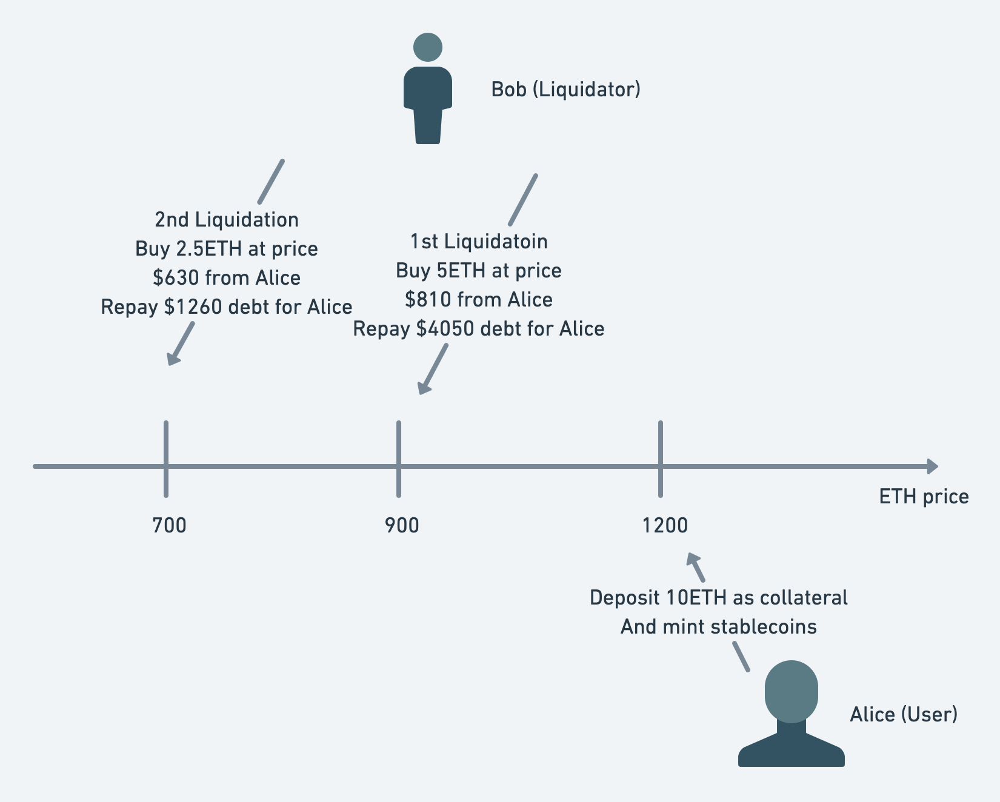
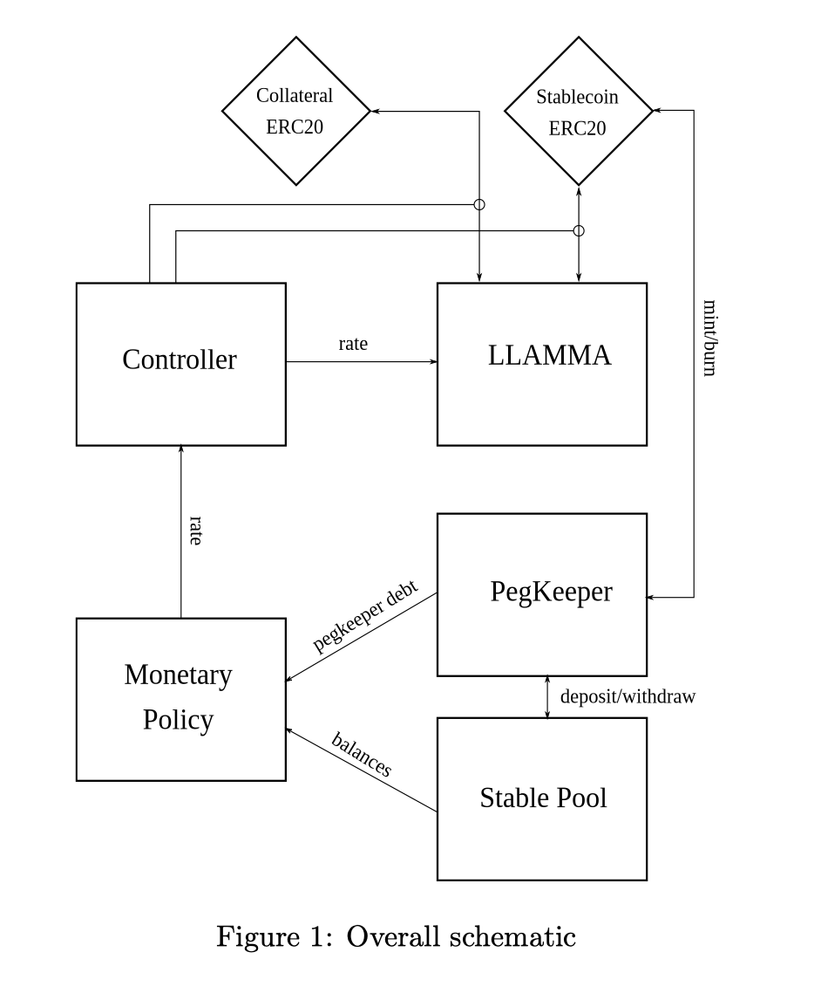
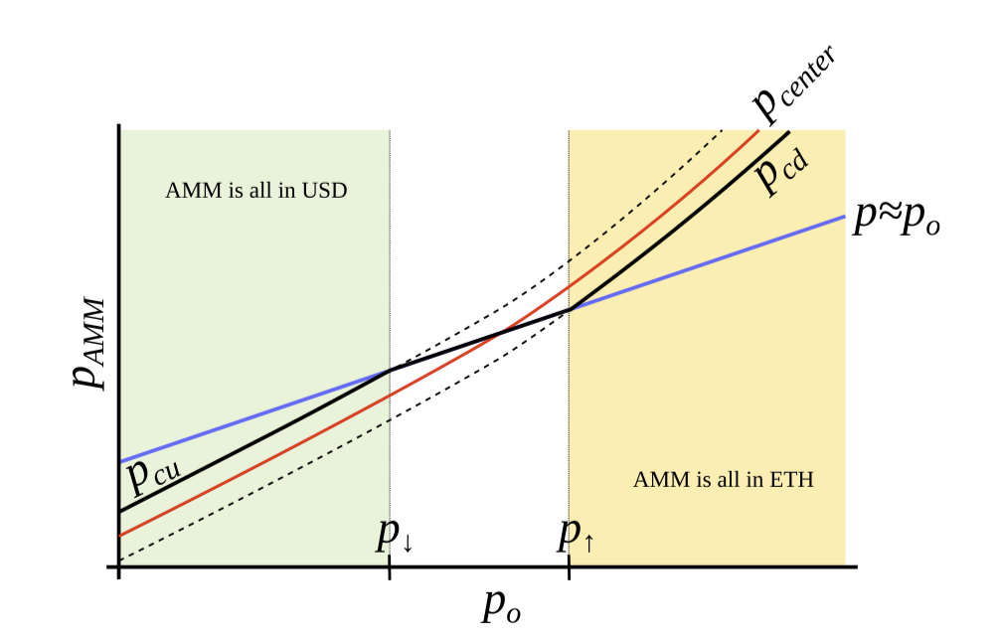
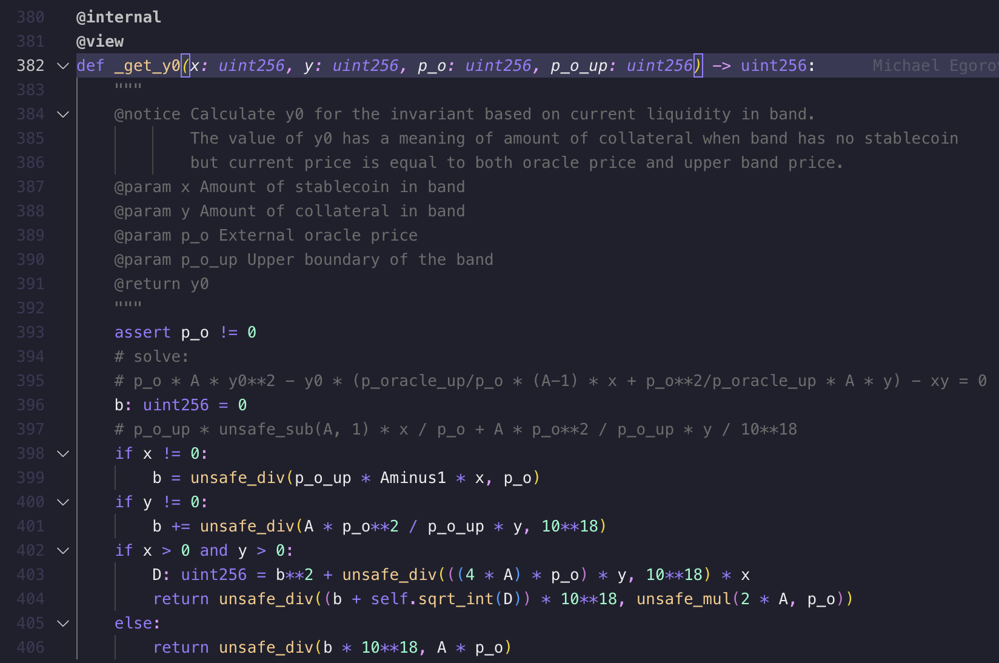
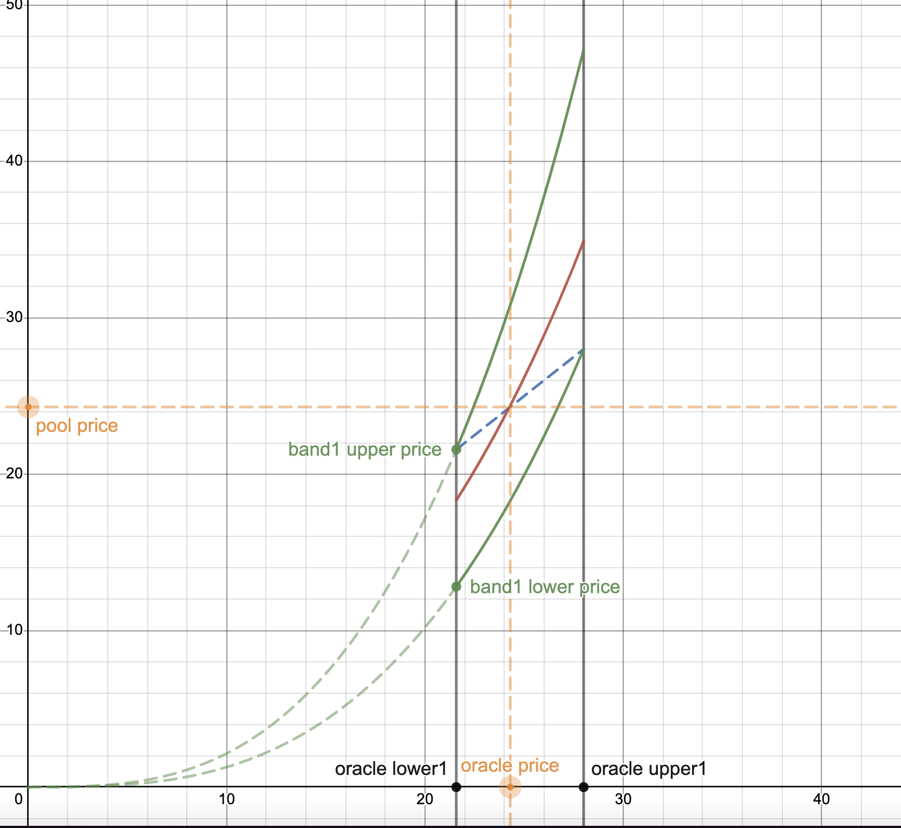
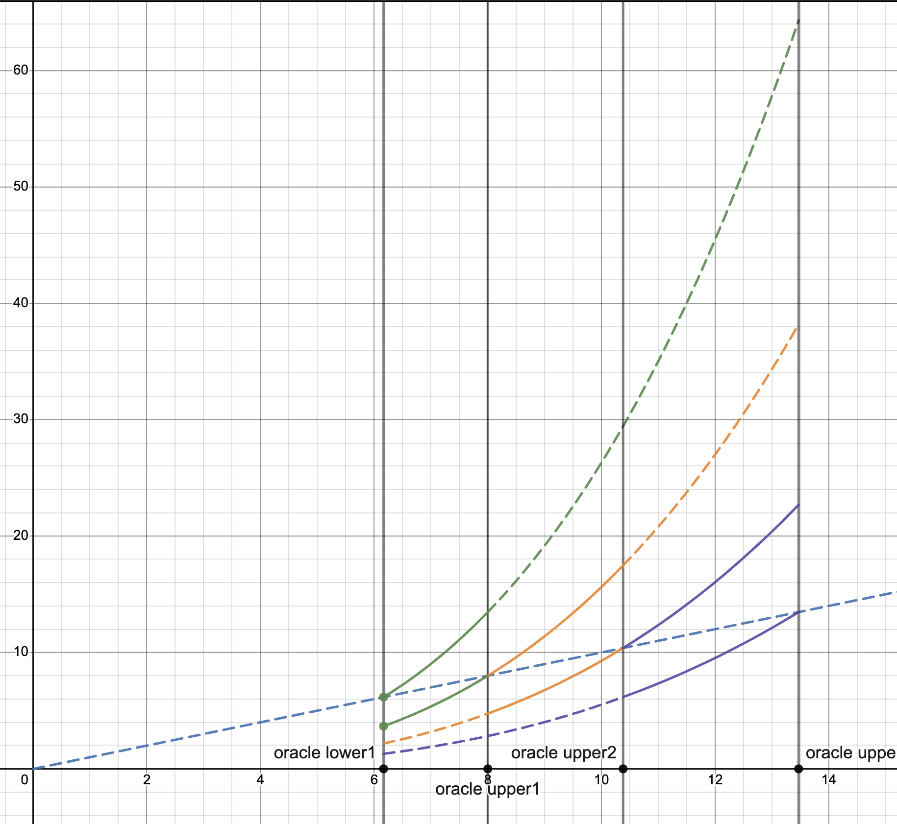
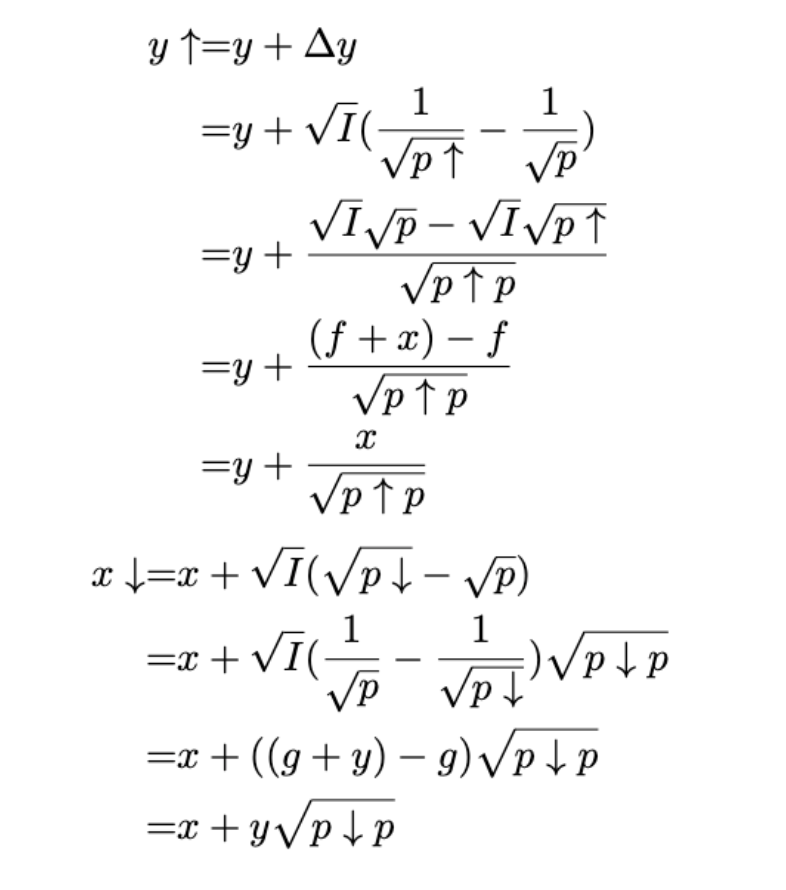
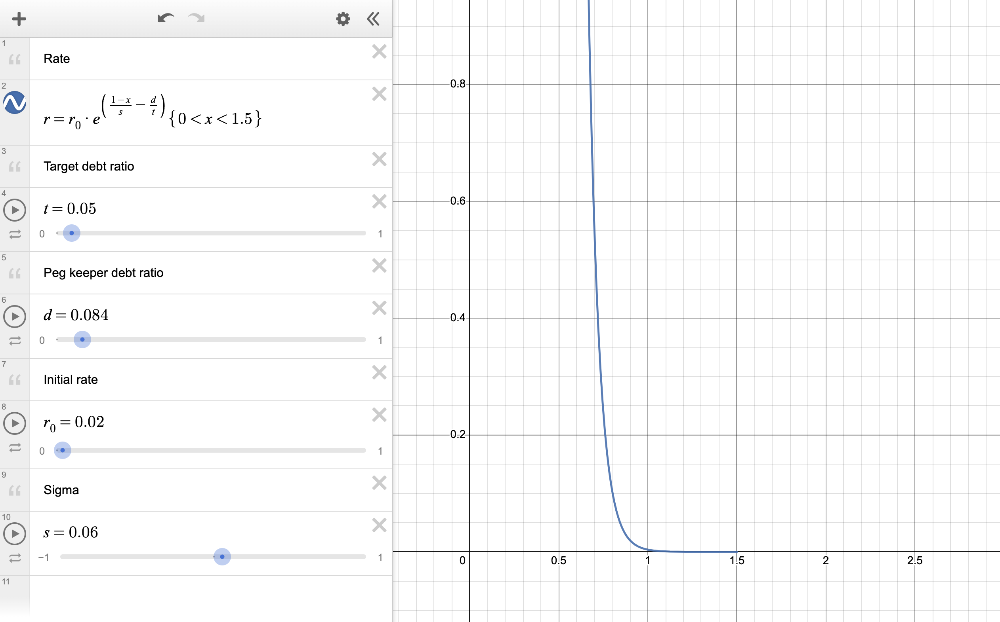
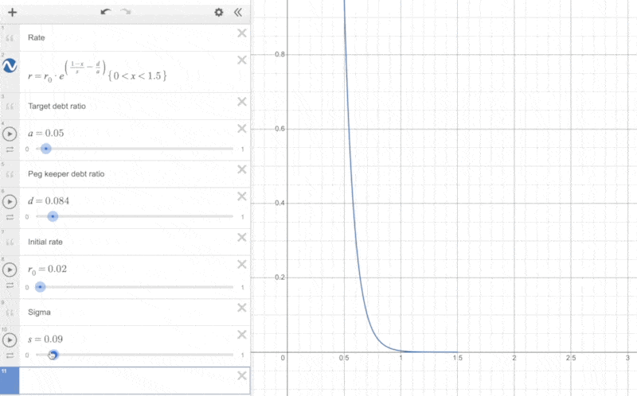
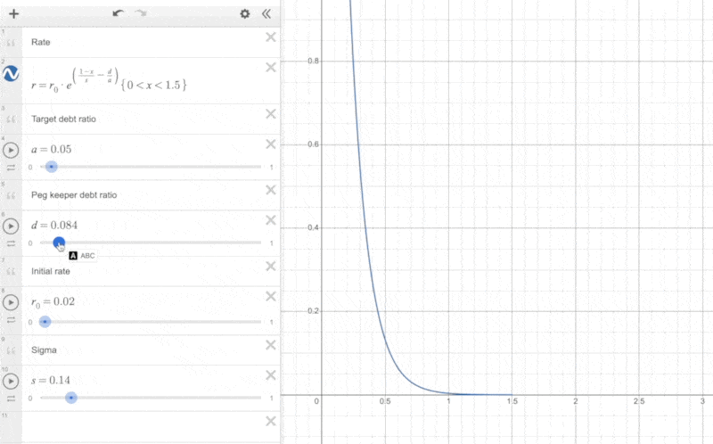

Curve Stablecoin 是 Curve 团队设计的新一代稳定币协议，相较于传统的稳定币协议或借贷协议如 makerDAO, Liquity, Compound 等，Curve Stablecoin 主要的改进在于使用自带 AMM，更高效的解决了清算问题，从而很大程度降低了协议产生坏账的风险，同时这个 AMM 也能在清算时帮助消化被清算的资产，从而降低大量资产卖出对市场带来的波动性。

Curve 官方还没有公布这个稳定币的代币名称，后文会使用 crvUSD 来指代。

## 传统借贷/稳定币协议

在传统的借贷及稳定币协议中，通常对设置一个最低保证金率，当用户的保证金率到达此阈值之后，清算者可以来清算掉用户的部分资产，这里有一个简单的例子过程如下：

上图中用户 Alice 在 ETH 价格为 `$1200` 时抵押 10ETH 并铸造稳定币，假设 Alice 的清算线为 `$900`。

当价格来到 `$900` 时，Bob 作为清算者将以 `$810` 的价格（90% 折扣）从 Alice 账户中买走 5ETH（清算一半的资产），并帮助 Alice 偿还 `$4050` 的债务。清算完成后，Alice 的抵押品资产剩余 5ETH，债务减少 `$4050`，Alice 的保证金率回归健康水平。

如果价格继续下跌至 `$700`，Alice 将遭遇第二次清算，这次清算 Bob 以 `$630` 的价格从 Alice 账户买走 2.5ETH，并帮 Alice 偿还 `$1260` 的债务。

如果价格仍然继续下跌，Alice 将会继续被清算，直至所有资产被清算完。

### 缺陷

这样的清算流程会有下面的问题：

1. 当用户保证率不够时，协议就需要清算用户的一部分资产，如果用户资产太多，那么意味着将一次性产生大量的待清算资产。
2. 清算者通常使用闪电贷的方式来提高资金利用率，这需要在清算完成后，立即将清算到手的资产卖掉来偿还闪电贷，这样就会对现货市场产生大量的抛压，当待清算资产仓位太大时，很有可能出现现货市场价格暴跌。
3. 如果资产价格持续下跌，而清算又不能及时完成，协议将会面临坏账的风险。
4. 为了保证清算者有足够的动力，用户的资产会被低价卖出，这样每次清算都会给用户带来不小的损失。
5. 清算一旦发生，用户将产生不可逆的损失，即使清算后用户的抵押资产价格上涨，产生的损失也无法再挽回了。

关于上面提到的协议坏账风险，这里有一个实际发生的例子：[How AAVE's $1.6 Million Bad Debt Was Created](https://eigenphi.substack.com/p/how-aaves-16-million-bad-debt-was-333).

一个大户 Avi（Mango 协议的攻击者）在 AAVE 中抵押了大量资产借出 CRV，想通过售卖 CRV 借机清算 Curve 创始人 Michael 的仓位（Michael 在 AAVE 上抵押 CRV 借出了大量 USDC），Michael 随即在当天公开了 Curve Stablecoin 的白皮书作为回应（意思是我们还有很多 alpha 呢）。由于散户情绪被点燃，纷纷主动买入 CRV 拉高价格，导致 Avi 在 AAVE 的仓位被清算，而 Avi 的仓位太大，整个清算过程持续了几十分钟，由于清算不够及时，最终 AAVE 产生了 $1.6m 的坏账。

在这个例子中，AAVE 作为借贷平台对风险控制不得当，最终产生了坏账。并且，无论 CRV 价格涨跌，被清算的人是 Michael 或者 Avi，由于他们的仓位都太大，AAVE 很难逃脱坏账的结果。

# Curve Stablecoin

Curve Stablecoin 就是为了解决上述缺陷而诞生的。在清算层面，Curve Stablecoin 主要有以下改进：

- 自带专门为清算而设计的 AMM，从而减小了对外部流动性的依赖
- 将阶段性清算改成渐进式清算，使得清算过程更为平滑，被清算用户的损失会更小
- 清算过程是可逆的，当用户资产价格上涨后，AMM 将会帮助用户重新买回被清算的资产，从而进一步减小用户的损失

整个协议有如下组件构成(下图摘自白皮书)：

- LLAMMA(lending-liquidating amm algorithm)，一个专门为清算设计的 AMM，这个名字是为了谐音 llama（Curve 社区的吉祥物）
- Controller，负责用户交互的逻辑，以及管理用户在 LLAMMA 中的流动性
- Monetary Policy，用来动态调节稳定币利息的合约
- PegKeeper，一组用来帮助稳定 crvUSD 币价的合约
- Stable Pool，crvUSD 在 Curve V1 中的池子
- Arbitrageurs，通过对 LLAMMA 套利来帮助清算用户资产

## LLAMMA

在 Curve Stablecoin 的众多组件中，最为核心的就是 LLAMMA，它是一个专门为清算而设计的 AMM。

假设 crvUSD 使用 ETH 作为抵押品，那么 LLAMMA 将是一个 crvUSD-ETH 的 AMM。

LLAMMA 使用了类似 Uniswap V3 的设计，例如 LLAMMA 也是用区间（在 LLAMMA 中叫做 band）来划分流动性，用户可以向 AMM 的某一个区间提供流动性。

但是 LLAMMA 和 Uniswap V3 很大的一个不同是 AMM Pool 中 2 个 token 余额的随价格变化的模式， 以 ETH/USD 为例：

在 Uniswap V3 中（上图中虚线上半部分），用户选择在 Lower ～ Upper Price 提供流动性，在 Uniswap 中被称为一个 range。当 ETH 价格大于或等于 Upper Price 时，用户的流动性中，全部为 USD，随着价格下跌，用户流动性中的 USD 被转换成了 ETH。当 ETH 价格小于或等于 Lower Price 时，用户的流动性中将全部为 ETH。

在 LLAMMA 中（上图中虚线下半部分），用户抵押 ETH 借出 crvUSD，用户的 ETH 将被加入到 LLAMMA 中的某一个区间（这个区间的上下界价格就是开始/结束清算的价格）来提供流动性，Curve 中将其称作 band。在最开始，价格会大于 band 的 Liquidation begin price，band 中流动性全部为 ETH. 当价格下跌，band 中的 ETH 开始被转换成 crvUSD，当价格跌至 band 下界价格（外部价格）时，用户的资产被全部转换成 crvUSD.

可以发现在 LLAMMA 中，一个 band 内 token 余额变化情况刚好和 Uniswap 相反。这样就能实现清算用户资产的目的：当处于高价时，用户的资产 ETH 原封不动的放在流动性内，当价格下跌至用户流动性区间上限价格时，开始将用户的 ETH 转换成 crvUSD，当价格下跌至区间下限价格时，用户的所有 ETH 都被转换成了 crvUSD，我们假设转换完成后用户得到的 crvUSD 大于用户的债务，那么协议将不会有坏账风险，并且整个过程不需要传统借贷协议中清算者角色的介入。

这么做的好处是：

- AMM 自带流动性，减小了对外部流动性的依赖（但也并不是完全不依赖）
- 不需要传统借贷协议的清算者（但在某些极端情况仍然会发生强制清算），整个清算过程是伴随价格下跌，AMM 内余额的 rebalance 来完成的
- 清算是持续性的，而非阶段性的，这样用户资产每次被卖出时会以更贴近市场外部价格的水平被卖出，对用户来说，清算造成的损失也就更小
- 如果价格反弹，crvUSD 会被转换成 ETH，用户的资产被买回，这样就能在波动性的市场中，避免了用户产生永久性损失（但也即使价格还原，也很难做到完全无损失，因为 LLAMMA 始终都会让 Pool 中的资产折价被卖出）

### LLAMMA 设计

接下来我们来看看 LLAMMA 具体是如何设计的。为了实现余额变化和 Uniswap V3 相反，LLAMMA 需要让流动性使用动态的上下界价格：

上图横轴 $p_o$ 表示 ETH 的外部价格，纵轴为 AMM 内部价格。蓝色线为一个斜率为 1 的直线，表示 AMM 内部价格追随外部价格变动。$p_{cu}$ 和 $p_{cd}$ 分别表示 AMM 中某个 band 的上下界价格，$p_↑$ 和 $p_↓$ 分别表示外部价格坐标中选定的两个参考边界价格。

我们可以发现，当外部价格 $p_o$ 增大时，$p_{cu}$ 和 $p_{cd}$ 和 AMM 内部价格会以更快的速度变大（convex curve），当外部价格 $p_o$ 变小时， $p_{cu}$ 和 $p_{cd}$ 和 AMM 内部价格则会以更快的速度变小。

并且，当 $p_o\ =\ p_↑$ 时，$p_{cd}$ 刚好满足 $p_{cd} = p_o\ =\ p_↑$，当 $p_o\ =\ p_↓$ 时，$p_{cu}$ 刚好满足 $p_{cu} = p_o\ =\ p_↓$.

如果我们能设计出这样一种随着外部价格动态改变区间上下界价格的 AMM，那么在这个 AMM 中：

- 当外部价格 $p_o \geq p_↑$ 时，band 的下界价格 $p_{cd} >= p_o$，这就对应了 Uniswap V3 中区间处于价外，且外部价格小于区间下界的情景，和 Uniswap V3 一样，这个区间中将全部为 ETH
- 当外部价格 $p_o \leq p_↓$ 时，band 的上界价格 $p_{cu} <= p_o$，这就对应了 Uniswap V3 中区间处于价外，且外部价格大于区间上界的情景，那么和 Uniswap V3 也一样，这个区间中将全部为 crvUSD

这样 AMM 的区间就能够在 $p_o$ 处于 $[p_↑\ -\ p_↓]$ 之间变动时，band 内部余额变化和 Uniswap V3 刚好相反。 假设初始状态下 $p_o > p_↑$，随着 $p_o$ 下降到 $p_↑$，用户在 band 内的 ETH 开始被转换成 crvUSD，直至 $p_o = p_↓$ 用户的额资产全部被转换成 crvUSD.

### LLAMMA 实现

由前所述，LLAMMA 需要知道外部的资产价格 $p_o$，在具体实现中，LLAMMA 使用的是 Curve V2 的 Oracle 价格，并在此之上进行 EMA 处理。LLAMMA 会在外部价格坐标上预先定义好连续的一串价格，这些价格序列满足等比数列，用户可以选择其中 2 个价格作为用户流动性的上下界参考价格（$p_↑$ 和 $p_↓$）。所以有：

$$
\frac{p_↓}{p_↑} = \frac{A-1}{A}
$$

其中 A 为一个大于 1 的常数，在 LLAMMA 池创建时设定。A 越大则外部价格坐标上的边界价格之间比例越小，分布越密集。这个设计很像 Uniswap 中 tick 的设计，但是要注意的是，这里的 $p_↑$ 和 $p_↓$ 都是指的外部价格，而不是 AMM 内部价格。

在具体设计上，LLAMMA 也满足一个类似 Uniswap V3 的恒等式：

$$
I = (x+f)(y+g)
$$

其中 $x$ 表示 crvUSD，$y$ 表示 ETH. 和 Uniswap V3 一样，AMM 中价格（ETH 价格）可以这样表示：

$$
p = \frac{f + x}{g + y}
$$

与 Uniswap 不同的是，上式中 $f$ 和 $g$ 均为动态变量，且和外部价格 $p_o$ 相关。$f$ 和 $g$ 的函数如下：

$$
f = \frac{p_o^2}{p_↑}Ay_0\ \ \ \ \ \ g = \frac{p_↑}{p_o}(A - 1)y_0
$$

公式中的 $y_0$ 表示当 $p_o = p_↑$ 时，区间内 ETH 的数量，在此状态下，AMM 内 token 余额满足：$y=y_0$, $x=0$。这里我们可以先假定 $y_0$ 为一个常数（实际上 $y_0$ 并不是一个常数，但这里可以先忽略它的改变），公式中的 $p_↑$ 和 A 也是常数。 Michael 并没有给出这两个函数的设计过程，但是我们可以从看出这样设计的目的：

> 随着外部价格 $p_o$ 上涨，f 以指数级增长，而 g 变小，反之 $p_o$ 下跌，f 以指数级减小，g 则会变大

我们再结合 AMM 的价格公式 $p = \frac{f + x}{g + y}$，可以看出当外部价格 $p_o$ 上涨时，LLAMMA 内部价格 $p$ 也会上涨，并且上涨速度会远高于外部价格上涨速度（分母变小而分子指数级增大），而当外部价格 $p_o$ 下跌时，LLAMMA 内部价格 $p$ 则以更快速度下跌。

这样 LLAMMA 就实现了第一个特性：**即使不发生交易，LLAMMA 内部价格也会随着外部价格自动改变，且变化速度更快**。

通过这种自动调节 AMM 价格的方式，LLAMMA 内 token 余额随价格的改变就表现出了和 Uniswap V3 相反的行为，例如当 ETH 的外部价格下跌时：

- 在 Uniswap 中，AMM 内部价格不会改变，**套利者**会在 Uniswap 中卖出价格相对较高的 ETH，因此 Uniswap Pool 的 ETH 增加而 USD 会减少
- 在 LLAMMA 中， AMM 内部价格会下跌的比外部价格更多，**套利者**会在 LLAMMA 中买入价格相对较低的 ETH，因此 **LLAMMA Pool 中的 ETH 减少而 USD 会增加**

可以看出，价格下跌时，LLAMMA 通过制造价差的方式，吸引套利者介入，套利者从 LLAMMA 中买入 ETH 的行为其实就是在清算用户的资产，而套利者的获利即为买入的价差。

同样的道理，当价格下跌至清算区间后，又开始反弹升高时，LLAMMA 也会通过价差，抬高 AMM 内部的价格，让套利者将 ETH 卖出到 LLAMMA 池子中，帮助用户买回了它的资产。

**但是在这里 LLAMMA 并不一定能帮用户买回所有的原始抵押资产**，这是因为 LLAMMA 主动改变 AMM 价格的行为导致的 AMM Path Dependence 问题（可以参考[这条 Tweet](https://twitter.com/danrobinson/status/1595090420740112385)）。简单说就是随着外部价格的移动，LLAMMA 一直在让利给套利者（低卖高买），这将造成用户资产损失，即使价格还原 LLAMMA 状态难以还原。

另值需要注意，由于 LLAMMA 内部价格变化与外部价格呈的指数级关系，**如果套利者的介入不够及时，或者外部价格变化幅度过大，将导致 LLAMMA 和外部价格产生比较大的价差，增大用户的损失**。为了避免外部价格的变动幅度过大，Curve 会使用 EMA 对外部 Oracle 价格处理之后再给 LLAMMA 使用。

### Swap 计算

当 $p_o = p_↑$ 时，band 内全部为 ETH，且 ETH 数量为 $y_0$，此时 AMM 内 token 余额状态是 $y=y_0$, $x=0$. 把 $f$ 和 $g$ 带入恒等式得到：

$$
I = p_oA^2y_0^2
$$

把这个恒等式推广到 $p_o$ 为 $p_↑$ ~ $p_↓$ 任意价格：

$$
(\frac{p_o^2}{p_↑}Ay_0 + x)(\frac{p_↑}{p_o}(A-1)y_0 + y) = p_oA^2y_0^2
$$

之前提到 $y_0$ 并不是一个常数，实际上它也是一个关于 $p_o$ 的函数，上面的公式可以写成关于 $y_0$ 的一元二次方程：

$$
p_oAy_0^2 - y_0(\frac{p_↑}{p_o}(A - 1)x + \frac{p_o^2}{p_↑}Ay) - xy = 0
$$

在任意时刻，我们可以知道 AMM 中 $x$, $y$ 余额，外部价格 $p_o$ 以及 band 的参考上限价格 $p_↑$，那么就可以求出此方程中的未知数 $y_0$. 在 Curve 合约中，求解 $y_0$ 的代码对应为 `AMM.get_y0()` 函数：

求出 $y_0$ 之后，就可以用上面的公式来计算交易者在 AMM 中 swap 的 output amount，在 Curve 合约中，计算 swap output amount 的代码对应为 `AMM.calc_swap_out()` 函数，这是一个非常长的函数，为了节约篇幅，这里不再展示具体代码实现。

简单描述一次 x -> y swap 的计算过程：

1. 找到离当前价格最近，且有流动性的 band
2. 读取 band 内的 x，y，计算 y_0
3. 计算当 y=0 时，需要的 $Δx$
4. 如果 $Δx$ <= `swap input amount`，则用户在此 band swap 得到 $y$，然后从第 1 步开始，进入下一个 band 进行 swap
5. 如果 $Δx$ > `swap input amount`，则将 $x$ = $x$ + `swap input amount`，计算 $Δy$，并结束 swap

用户得到的 y 数量即为此次 swap 经过的所有 band 内计算结果的总和。如果这个 swap 是 y -> x，计算过程也大体相同。

注意，这个过程中，在一个 band 内的 swap 计算都是将 $y_0$ 当作定值来计算的（使用的是 swap 前的状态），这样做工程上会更容易实现，并且误差不会太大（只要 band 间距不要太大）。

### Band range price

对一个 band 来说，$p_{cu}$ 和 $p_{cd}$ 分别是这个 band 在 AMM 内的上限价格和下限价格，当 AMM 内部价格到达上限价格 $p_{cu}$ 时，和 Uniswap V3 一样，band 内部 $y = 0$，当 AMM 价格到达下限价格 $p_{cd}$ 时，band 内部 $x = 0$. 我们将 $x = 0$ 代入 LLAMMA 的恒等式中，可以求出 $y$，此时 AMM 的价格即为下限价格 $p_{cd}$，同理也通过 $y = 0$ 时的 AMM 价格来表示 band 上限价格 $p_{cu}$. 将这两个价格公式简化后得到：

$$
p_{cd} = \frac{p_o^3}{p_↑^2}\ \ \ \ \ \ p_{cu} = \frac{p_o^3}{p_↓^2}
$$

对于一个 band 来说，${p_↓}$ 和 ${p_↑}$ 为固定值，那么 band 中 $p_{cd}$  和 $p_{cu}$ 只和外部价格 $p_o$ 有关。

我们可以发现 LLAMMA 中第二个特性： **LLAMMA 内 band 的上下限价格也会随着外部价格自动改变，且变化速度更快**。

我们用图形来表示 LLAMMA 的两个特性（图片截取自 [desmos](https://www.desmos.com/calculator/zepny2jhpq)）：

上图横坐标为外部价格，纵坐标为 AMM 内价格，黑色实线表示一个 band 对应的参考外部上限界价格（$p_↑$ 和 $p_↓$），绿色实线表示此 band 的上下限价格（$p_{cu}$ 和 $p_{cd}$），蓝色虚线是一个斜率为 1 的虚线，表示此时 AMM 价格 $p$ 等于外部价格 $p_o$，红色实现表示 AMM 内部价格。

我们可以发现，**随着外部价格增长，band 的上下限价格和 AMM 内部价格都会以更快速度增长，且 AMM 内部价格始终处于 band 的上下限价格之内**。

### Band 之间的关系

LLAMMA pool 在创建时还需要设定一个 $p_{base}$ 作为一个起始参考价格。接下来就可以计算出所有的 $p_↑$ 和 $p_↓$：

$$
p_↑(n) = (\frac{A - 1}{A})^np_{base}\ \ \ \ \ \ p_↓(n) = (\frac{A - 1}{A})^{n+1}p_{base}
$$

由于 $p_↑$ 和 $p_↓$ 都是固定值，那么只要确定好 $p_o$ 的值之后，就可以知道每一个 band 中的上下限价格 $p_{cu}$ 和 $p_{cd}$ 了。

这幅图展示了三个 band 之间的关系（图片截取自 [desmos](https://www.desmos.com/calculator/60wavzznor)）：

上图中横坐标表示外部价格，纵坐标表示内部价格，蓝色虚线为斜率为 1 的直线。图中包含了 4 个预定义的参考外部上限界价格，他们之间组成了 3 个 band，每个 band 中在 AMM 内上下限价格分别为绿色，橙色和紫色的曲线。实线部分表示此 band 在预期会处于 active 状态，即可用来进行 swap（清算），虚线表示此 band 大概率在价外，处于未开始 swap 或者已经被全部 swap 完的状态。

仔细看可以发现蓝色的虚线分别穿过了每个 band 中 $p_{cu} = p_↓$ 的点和 $p_{cd} = p_↑$ 的点，这样能保证当 AMM 内价格始终和外部价格相近时，当外部价格到达 band 的 $[p_↑-p_↓]$ 中间时，band 会按照预期处于 active 状态（此时蓝色的虚线会在 band 的 $p_{cu}$ 和 $p_{cd}$ 之间）。

并且前一个 band 的 ${p_{cd}}$ 会和下一个 band 的 ${p_{cu}}$ 相重合，这样保证了 band 之间不会存在间隙，band 内的流动性在 AMM 内部价格区间上也是连续的。

可以用下面的公式表示上述关系：

$$
p(x = 0, y > 0, n) = p_{cd}(n) = p_{cu}(n - 1) \\
\\
p(x > 0, y = 0, n) = p_{cu}(n) = p_{cd}(n + 1)
$$

再上图中还可以发现，在外部价格范围中，外部价格较低的 band （左边）中的 $p_{cu}$ 和 $p_{cd}$ 反而高于外部价格更高处（右边）band 中的 $p_{cu}$ 和 $p_{cd}$.

### 清算/赎回结果估算

在实际合约中，用户的资金会存入一组连续的 band 中（至少为 5 个），那么最大 band 的 $p_↑$ 则是用户资产的清算起始价格，最小 band 的 $p_↓$ 是用户资产的清算结束价格，到达此价格后，用户的 ETH 将被全部转换成 crvUSD.

当用户存入 ETH 铸造 crvUSD 时，Curve 需要帮助用户选择一组合适的 band，将用户的 ETH 存入这组 band 中，这组 band 需要能够满足：当用户 ETH 被全部转换成 crvUSD 时，得到的 crvUSD 数量应该大于用户的债务（实际合约中还需乘以一个系数来留一些余地），这样才能保证协议不会出现坏账。

因此我们需要在用户存入 ETH 到 band 时进行估算：当 ETH 外部价格降低，band 中 ETH 全部交易成 crvUSD 后得到的数量，我们将其记做 $x_↓$，另外我们还可以用同样方式估算，当外部价格反弹，band 中 crvUSD 全部交易成 ETH 后得到的 ETH 数量，将其记做 $y_↑$.

这里 Curve 给出的估算公式为：

$$
y_↑ = y + \frac{x}{\sqrt{p_↑p}} \\
\\
x_↓ = x + y\sqrt{p_↓p}
$$

这组公式使用了最乐观的估算的方式，即预估结果的最大值。前面我们说到外部价格的变化，会导致 LLAMMA 价格变化，产生和外部价格的价差，套利者的进入会导致用户产生损失，为了估算结果的最大值，我们需要假设：

- 外部价格以极其缓慢的速度变化，这意味着在一定时间内，外部价格和 LLAMMA 内部价格的价差极小，可以忽略
- 交易者在 LLAMMA 中交易，使得 LLAMMA 内部价格跟随外部价格同步变化，由于 AMM 内价格和外部价格的价差可以忽略，用户在交易过程中不会产生因为价差而造成的损失

这两个假定即 Curve 白皮书中所描述的 *adiabatically* 的含义，*adiabatically* 在物理学中表示绝热，在这里我们可以理解成隔绝了价差套利交易的一种理想状态。

满足这种理想状态时，LLAMMA 可以直接使用 Uniswap V3 的公式，计算出 swap 结果，即上述两个公式，公式的推导过程为：

通过这种预估方式，`Controller` 合约会根据用户的债务，抵押品价值以及选择的 band 宽度来帮助用户将流动性添加到合适的 band 中。

并且，有了清算/赎回结果估算，就可以在任意时刻知道用户的资产在被全部 swap 完成之后，是否足够偿付债务。如果在某一时刻发现用户的资产即使被全部 swap 成 crvUSD 也不够偿还他的债务，则需要清算者介入进行强制清算，具体过程和传统借贷清算过程类似，本文不再赘述。

当 $p = p_↑ = p_{cd}$ 时，AMM 内 $x = 0$. 因此，$x_↓ = y\sqrt{p_↓p_↑}$，即**理想情况下，用户资产被卖出的均价为用户 bands 的参考上下限价格的几何平均数：$\sqrt{p_↓p_↑}$，同理用户资产被赎回时的价格也是这个几何平均数**。

合约中和上述描述相关的函数为 `Controller.get_y_effective()`, `AMM.get_x_down()`, `AMM.get_y_up()`, `Controller.liquidate()` 等，由于篇幅有限，这里不再解释代码实现细节。

### LLAMMA 小结

我们总结一下 LLAMMA 的特性：

- LLAMMA Pool 中包含预定义的连续的 band，添加流动性时，可以将 token 添加到一组 band 中
- band 由外部的参考价格 $p_↑$ 和 $p_↓$ 决定，他们之间的价格呈等比数列
- band 在 AMM 内部的 $p_{cu}$ 和 $p_{cd}$，表示 band 在 AMM 内的上下界价格
- LLAMMA AMM 价格和所有 band 的 $p_{cu}$ 和 $p_{cd}$ 都会随着外部价格 $p_o$ 的增大而增大，且变化速度更快，反之亦然
- 用户在创建债务的时候，资产将会被存入一组 band 中（这些 band 一定处于 AMM 价格外，因此只会添加 ETH 单币）
- 当 ETH 价格下跌，到达用户流动性中最大 band 的上限参考价格 $p_↑$ 时，此时理论上（假设存在足够多的套利和交易者）满足 $p = p_{cd} = p_↑$，用户的资产开始被清算
- ETH 价格继续下跌，到达用户流动性中最小 band 的下限参考价格 $p_↓$ 时，此时理论上满足 $p = p_{cu} = p_↓$，用户的资产被全部清算成 crvUSD
- 如果 ETH 价格开始反弹上升，则 LLAMMA 会帮助用户买回他的抵押资产 ETH

LLAMMA 只会对外暴露 swap 接口，而不会直接对用户暴露添加/移除流动性的接口，因此用户在不创建债务的情况下时不能擅自添加流动性到 LLAMMA 中，这些相关操作有专门的 `Controller` 来负责。

## Controller

Controller 对外实现用户的交互接口，内部则会对接 LLAMMA，负责将用户资产存入/取出 LLAMMA.

当用户存入创建债务时，需要指定这些参数：

- ETH 抵押品数量
- 创建 crvUSD 债务的大小
- ETH 存入 LLAMMA 一组连续 band 中 band 的个数

其中第三个参数 band 的个数最少为 5 个，至多为 50 个。Controller 会根据这三个参数计算出用户需要存入的 band，并将用户的 ETH 存入到这些 band 中（这些 band 一定处于价外，因此添加流动性是添加 ETH 单币）。同时将 crvUSD 发送给用户，用户的债务即为 mint crvUSD 的数量。

这个过程用到了前面提到的清算结果估算公式，在合约用对应函数 `Controller.create_loan()`，这里我不再详细解释这个函数的实现，如果感兴趣可以参考我在 Curve Discord 的[这个回复](https://discord.com/channels/729808684359876718/1044834395678310490/1048943587724906506)。

除此之外，`Controller` 还有增加抵押品，偿还债务，取出抵押品，强制清算，借贷利息维护等功能，本文也再不一一赘述了。

## PegKeeper

PegKeeper 也叫做 stabilizer，是一组用来帮助 crvUSD 价格维持锚定的合约，这些合约主要用来和 Curve V1 pool 进行交互。

crvUSD 上线后，会在 Curve V1 中创建对应的池子。为了示例的简便，这里我们假设 crvUSD 和 DAI, USDT 各创建一个 Curve V1 池。假设 crvUSD 的价格为 $p_s$：

- 当 $p_s > 1$ 时，意味着 crvUSD 供给不足，PegKeeper 会 mint 出 crvUSD 并添加到 Curve V1 池子中（添加 crvUSD 单币），以增加 crvUSD 的市场供给
- 当 $p_s < 1$ 时，意味着 crvUSD 供给过剩，PegKeeper 会将之前添加的流动性从 Curve V1 池子中移除（移除 crvUSD 单币），以减少 crvUSD 的市场供给

如下图所示：

PegKeeper 在进行这些操作的过程中，类似于低买高卖，可以产生利润，例如：

当 $p_s > 1$ 时，则说明 Curve V1 池子中 crvUSD 不足，外部账户可以调用 PegKeeper 合约，mint 出 crvUSD，加入到 Curve V1 池子中（添加 crvUSD 单币），要注意这些 mint 出来的 crvUSD 是无抵押品凭空 mint 出的，因此只能被 PegKeeper 添加到 Curve V1 池子中，mint 的总数量会记为 PegKeeper 合约的债务。

当 $p_s$ 价格回稳或者 $p_s < 1$ 后，外部账户可以调用 PegKeeper 合约，将之前添加的流动性从 Curve V1 池子中取出，取出时仅移除 crvUSD 单币，并偿还 PegKeeper 之前产生的债务。

PegKeeper 从 Curve V1 中添加/移除 crvUSD 都是单币添加/移除，这些操作都能够直接改变 Curve V1 池子中 crvUSD 的价格，使之更趋近于锚定价格。

另外由于添加时 crvUSD 价格高，移除时 crvUSD 价格低，PegKeeper 在偿还债务后会剩余一些 LP token，这些 LP token 就是 PegKeeper 产生的利润。这些利润会在每次外部调用者调用 PegKeeper 合约时将产生利润的 1/1000 分给外部调用者作为 gas 补偿和激励，剩余的利润则会保留作为协议收益。

但是外部调用者并不能随意的调用 PegKeeper，合约内设置有一系列的检查，以防止恶意调用，并确保调用能够让 PegKeeper 产生利润。

要注意的是，在应对两种市场情况时，PegKeeper 的能力不是完全对称的：

- 当 $p_s > 1$ 时，PegKeeper 可以无抵押凭空 mint 出 crvUSD 加入到 Curve V1 pool 来进行市场调节，因为 PegKeeper 不需要抵押品，此时 PegKeeper 的市场调节能力在理论上是无上限的
- 当 $p_s < 1$ 时，PegKeeper 只能将之前添加到 Curve V1 pool 中的流动性移除来进行市场调节，此时 PegKeeper 的能力受限于此前在 $p_s > 1$ 时 mint 出的 crvUSD 数量。如果 PegKeeper 此前完全没有 mint 过 crvUSD，或者 PegKeeper 在移除了所有流动性之后，crvUSD 价格仍然小于 1，此时出现巧妇难为无米之炊的情形

因此，为了弥补 $p_s < 1$ 时，PegKeeper 能力不足的缺陷，Curve Stablecoin 还需要通过调节利息的方式，来进一步帮助 crvUSD 价格锚定。

## Monetary Policy

一个动态调节借贷利率的组件，用来根据市场供需调节利率，进一步帮助稳定 crvUSD 的价格锚定，主要用于 crvUSD 价格 $p_s < 1$ 的场景。

> Curve Stablecoin 的开源代码中利率的实现逻辑和白皮书中略有不同，这里我会按照实际代码中的逻辑来解释。

我们将 PegKeeper 产生的总债务记做 $d_{pk}$，用户通过 Controller 产生的总债务记做 $d_{t}$，两者债务的比例我们记做 $r_d$，crvUSD 价格记做 $p$，同时我们定义一个基准利率 $r_0$，crvUSD 的利率为：

$$
r = r_0 \cdot e^{(\frac{1-p}{\sigma} - \frac{r_{d}}{\alpha})}
$$

上式中 $\sigma$ 为一个常数，$\alpha$ 为目标债务比例。

给这些参数设定一些值后（参数具体值需要等 crvUSD 上线才会知道），利率随价格变化的曲线如下图所示（截图自[desmos](https://www.desmos.com/calculator/hjjb1mroat)）：

可以发现：

- 当 crvUSD 价格大于 1 时，利率相对较低
- 当 crvUSD 价格小于 1 时，利率会在某个临界点后急剧飙升（上升速度取决于 $\sigma$）

这么设计的原因：

- 如果 crvUSD 价格大于 1，PegKeeper 有足够的能力来进行市场调节，此时保持低利率有助于吸引更多用户来铸造 crvUSD
- 如果 crvUSD 价格小于 1，PegKeeper 的能力受限。这时为了来减少 crvUSD 的市场供给，需要升高利率来逼迫用户偿还债务。为了避免脱锚产生的价差过大，利率升高的速度会在 crvUSD 低到某个临界点后开始快速上升，上升的速度会取决于 $\sigma$ 参数，利率开始上升的价格取决于 PegKeeper 的债务规模。

另外我们可以观察 $\sigma$ 参数和 PegKeeper 债务比例 $r_{d}$ 的变化对实际利率变化的影响：

可以看出 $\sigma$ 越接近 0，曲线则越陡峭，随价格下降利率升高速率越快。

当 PegKeeper 债务占比比较大时，则将曲线整体左移，利率开始上升的价格越低。

这么做的原因是，如果 PegKeeper 债务占比很大，说明 PegKeeper 在 Curve V1 中有不少流动性，当 crvUSD 价格小于 1时，可以先让 PegKeeper 从 Curve V1 中移除流动性（crvUSD 单币）来减少其债务，同时帮助 crvUSD 价格回归锚定。PegKeeper 债务越多，则需要 crvUSD 价格下跌的越多才会开始快速升高利率，这样做能帮助 PegKeeper 控制债务的规模。

## Oracle

由前所述，Curve Stablecoin 在 LLAMMA 中需要知道抵押品 ETH 的外部价格，在 PegKeeper 和 Monetary Policy 中需要知道 crvUSD 的外部价格。对于抵押品价格，Curve 会从 Curve V2 池中抓取，crvUSD 价格则会从对应 Curve V1 池中抓取（参考多个池子中的价格）。

Curve Stablecoin 在使用外部价格前会先会对这些价格进行 EMA 处理。前文说过，如果外部 Oracle 价格大幅波动，则 LLAMMA 价格会和外部价格产生较大的价差，造成用户损失。使用 EMA 价格可以帮助减少价格的波动，另外也可以增加 Oracle 价格操控的难度。

# FAQs

下面是关于 Curve Stablecoin 的一些常见问题

#### Curve Stablecoin 的最高借贷率是多少？

取决于 `Controller.loan_discount` 以及用户选择的 band 数量，当选择 band 数量为 5 时（最小值），用户可以 mint 的 crvUSD 数量最多。

前文中提过，当用户创建债务时，curve 预估的清算价格为 $\sqrt{p↑ \cdot p↓}$

假设当前 ETH price = p，band 数量为 N，`loan_discount` 为 $r$，抵押品 ETH 数量为 `y`，则可以借出最多的 crvUSD 数量为：

$$
x_{effective} = y \cdot (1-r) \cdot \sqrt{(p \cdot p \cdot (\frac{A-1}{A})^N)} = y \cdot (1-r) \cdot p \cdot (\frac{A-1}{A})^{\sqrt{\frac{N}{2}}}
$$

那么最高借贷率为：

$$
(1-r) \cdot (\frac{A-1}{A})^{\sqrt{\frac{N}{2}}}
$$

根据测试代码中的设定的 $A=100$，$r=0.05$，选择 band 数量 $N=5$ 时，借贷率最高，大概为：

$$
(1-0.05) \cdot (\frac{99}{100})^{\sqrt{\frac{5}{2}}} \approx 92.64\%
$$

此时清算的起始价格为 $p$，清算结束价格为 $p \cdot 0.99^5 \approx 0.95p$，预估平均清算价格为 $p \cdot 0.99^{2.5} \approx 0.97p$

#### 如何向 LLAMMA 中提供流动性？

用户只能通过 `Controller`，质押 ETH 创建 crvUSD 债务，ETH 会由 `Controller` 添加到 LLAMMA 中。普通用户也没有必要妄想在 LLAMMA 中做市，LLAMMA 的特性导致它的 LP 很大概率会在交易中亏损。

#### mint crvUSD 需要抵押 ETH 向 LLAMMA 提供流动性，那么用户的 ETH 会被放到哪里？

用户需要指定放入 band 的数量，之后 `Controller` 会根据用户债务规模，自动选择一组对用户风险最小的 band（即价格最低的一组 band，但同时还要保证协议不会有坏账风险）。

#### band 的数量如何选择？

用户创建债务时，需要选择 ETH 放入 band 的数量。

当 mint crvUSD 数量相同时，band 数量越多，抵押品分布越分散，清算的起始价格会高一些，数量越少，则抵押品分布越集中，清算的起始价格会相对低一些。

如果想要更高的借贷率，则需要选择更少的 band 数量，但同时也会增加清算的风险。

#### 用户在 mint crvUSD 时，Curve 具体是如何将用户 ETH 添加到 LLAMMA 中的？

- 因为用户的抵押品只有 ETH，那么这一定是一个单边流动性，即 band 中只有 ETH。
- Curve 会尽量将用户的 ETH 加入到价格较低的 band 中，但同时也要保证协议不会有坏账风险。

Curve 会根据用户的 ETH 数量，用户选择的 band 宽度，以及 mint crvUSD 的数量，选择合适的 band 并添加流动性。具体的逻辑如下：

假设用户的抵押品 ETH 数量为 $y$，我们可以用白皮书中的公式 10 来计算当用户的 ETH 被交易成 crvUSD 时得到的数量（为了简化，这里忽略 `loan_discount`）：

$$
x_↓ = y\sqrt{p_↑p_↓} = yp_↑\sqrt{\frac{A-1}{A}}
$$

用户的 ETH 被放入到了 N 个 band 中，每个 band 中 ETH 的数量为 $\frac{y}{N}$，假设价格最高的 band 编号为 $n_1$，上面的公式展开后可以得到：

$$
x_↓ = \frac{yp_↑}{N} \cdot \sum_{k=0}^{N-1}(\sqrt{\frac{A-1}{A}})^k
$$

我们定义一个仅与用户 band 宽度 $N$ 相关而与 band 价格无关的变量 $y_{effective}$:

$$
y_{effective} = \frac{y}{N} \cdot \sum_{k=0}^{N-1}(\sqrt{\frac{A-1}{A}})^k
$$

同时定义 $x_↓$ 为 $x_{effective}$，上面的公式简化为：

$$
x_{effective} = y_{effective} \cdot p_↑
$$

这里的 $p_↑$ 指的是用户 ETH 所加入 band 中的最高 $p_↑$ 价格，在代码中，$y_{effective}$ 的计算由 `Controller.get_y_effective()` 函数实现。

接下来我们首先假设用户的 ETH 被放到了价格最高的 band 中（低于当前 AMM 价格的 band），假设此 band 编号为 $n_1$，则此时 $x_{effective}$ 为：

$$
x_{effective} = y_{effective} \cdot p_{↑(n_1)}
$$

假设用户 mint 的 crvUSD 数量为 $debt$，为了将用户的 ETH 加入到价格最低的 band 中，我们需要将 $x_{effective}$ 降低，但又不能小于 $debt$（否则协议有坏账风险），即：

$$
\frac{y_{effective} \cdot p_{↑(n_1)}}{debt + 1} \geq 1
$$

接下来，我们的任务就是找到能使上式满足的最大 $n_1$ 值，$n_1$ 越大则用户 ETH 加入的 band 价格越低。在代码中，使用对数计算来完成上述过程：

$$
log(\frac{y_{effective} \cdot p_{↑(n_1)}}{debt + 1}) \geq 0
$$

假设我们需要将 band 编号从 $n_1$ 增大到 $n_1 + m$，则：

$$
log(\frac{y_{effective} \cdot p_{↑(n_1)}}{debt + 1} \cdot (\frac{A-1}{A})^m) \geq 0
$$

$$
log(\frac{y_{effective} \cdot p_{↑(n_1)}}{debt + 1}) \geq m \cdot log(\frac{A}{A-1})
$$

$$
m \leq \frac{log(\frac{y_{effective} \cdot p_{↑(n_1)}}{debt + 1})}{log(\frac{A}{A-1})}
$$

m 为整数，则：

$$
m = \lfloor \frac{log(\frac{y_{effective} \cdot p_{↑(n_1)}}{debt + 1})}{log(\frac{A}{A-1})} \rfloor
$$

上面的 $\lfloor \ \rfloor$ 表示向下取整，这样我们就可以计算出，用户的 ETH 被加入到 $[n_1 + m,\ n_1 + m + N]$ 的 band 中。在代码中，这部分计算在 `Controller._calculate_debt_n1()` 函数中实现。

#### 如果 ETH 价格下跌，导致用户的 ETH 被部分换成 crvUSD，之后 ETH 价格又反弹至清算线以上，用户还会有损失吗？

大概率会，因为 LLAMMA 的特性导致 Pool 会做低卖高买的操作，即使价格还原，Pool 中的资产也可能变少。

#### Curve Stablecoin 协议层面有哪些收益？

协议会有 LLAMMA 手续费，crvUSD 利息和 PegKeeper 利润三部分收益。

#### Curve Stablecoin 完全避免了清算吗？

并不是，仍然会出现强制清算的情况，当用户的预估清算后价值小于其债务时，清算者可以强制清算掉用户的资产，即将用户的资产从 LLAMMA 中取出，提前偿还其债务。

#### Curve Stablecoin 产生了哪些套利机会？

LLAMMA 会产生 Dex 价差套利机会，另外当 crvUSD 脱锚时，PegKeeper 也会产生套利机会。

#### 哪些代币可以作为抵押品？

A：理论上任何代币都可以，但是 Curve Stablecoin 并不是完全不依赖外部流动性，当抵押品价格降低，LLAMMA 下调价格后，仍然需要有外部 DEX/CEX 的流动性配合 LLAMMA 进行价差套利，套利者才有利可图。因此大概率最先上线支持的抵押品是 ETH，后续也可能支持新的抵押品。

#### 会有 Liquidity Mining 吗？

LLAMMA 合约层面适配了 CurveDAO Gauge 相关接口的， 因此大概率会支持挖矿，挖矿的算法是被清算资产价值越大，挖矿权重越高，这意味你必须借出 crvUSD 并且到达清算线之后才能产生挖矿收益，看起来是一个适合 degen 的游戏。

#### 有什么好的对冲策略吗？

LLAMMA 的特性决定了他是一个和 Uniswap V3 相反的 AMM，那么可以考虑这样对冲清算风险：

- 假设借出 1000 crvUSD ，ETH 被加入到了 LLAMMA 里 `[1300 ~ 1500]` 范围的 band 中
- 此时可以用 USDC/DAI/USDT 等代币在 Uniswap V3 上选择 `[1300 ~ 1500]` 范围加入单边流动性，USDC 数量也为 1000

这样当 ETH 价格下跌至 1500 时，LLAMMA 中的 ETH 会开始被卖出，但同时 Uniswap V3 中也会开始买入 ETH，这样就可以在任意价格维持 ETH 敞口不变。

如果有其他问题，欢迎在评论区留言讨论。

Ref:

- [Curve stablecoin whitepaper](https://github.com/curvefi/curve-stablecoin/blob/master/doc/curve-stablecoin.pdf)
- [From Uniswap v3 to crvUSD LLAMMA](https://www.curve.wiki/post/from-uniswap-v3-to-crvusd-llamma-%E8%8B%B1%E6%96%87%E7%89%88)

另感谢 [@0xstan](https://twitter.com/0xstan_) 和 [@0xmc](https://twitter.com/0xMC_com) 在研究过程中的交流和讨论。

